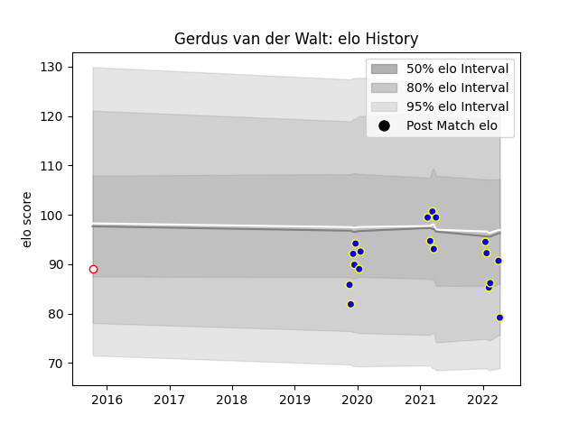

---  
layout: page  
title: Gerdus van der Walt  
date: 2023-03-21 18:25:25.379775  
categories: player  
---
# Gerdus van der Walt

Last updated: 2023-03-21
## Positions: C

## Current elo: 79.0

## Current Percentile: 36.0

# Elo History

# Match History

| Team              |   Appearances |   Win Rate |
|:------------------|--------------:|-----------:|
| Kamaishi Seawaves |            18 |   0.416667 |
| Golden Lions      |             1 |   1        |

| Opponent                         |   Matches |   Win Rate |
|:---------------------------------|----------:|-----------:|
| Hanazono Kintetsu Liners         |         3 |        0   |
| Kurita Water Gush                |         3 |        1   |
| Mie Honda Heat                   |         2 |        0   |
| Shimizu Blue Sharks              |         2 |        0.5 |
| Skyactivs Hiroshima              |         2 |        1   |
| Coca-Cola Red Sparks             |         1 |        0.5 |
| Griquas                          |         1 |        1   |
| Hino Red Dolphins                |         1 |        0   |
| Kyuden Voltex                    |         1 |        0   |
| Mazda Blue Zoomers               |         1 |        1   |
| Mitsubishi Dynaboars             |         1 |        0   |
| Toyota Industries Shuttles Aichi |         1 |        0   |