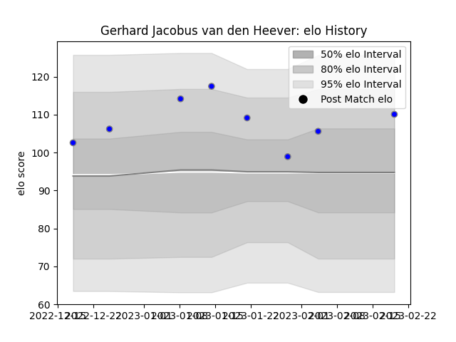

---  
layout: page  
title: Gerhard Jacobus van den Heever  
date: 2023-03-21 18:29:41.059896  
categories: player  
---
# Gerhard Jacobus van den Heever

Last updated: 2023-03-21
## Positions: FB, W

## Current elo: 112.0

## Current Percentile: 92.0

# Elo History

# Match History

| Team                              |   Appearances |   Win Rate |
|:----------------------------------|--------------:|-----------:|
| Kubota Spears Funabashi Tokyo-Bay |            11 |   0.863636 |

| Opponent                  |   Matches |   Win Rate |
|:--------------------------|----------:|-----------:|
| Yokohama Canon Eagles     |         2 |       0.75 |
| Black Rams Tokyo          |         1 |       1    |
| Green Rockets Tokatsu     |         1 |       1    |
| Hanazono Kintetsu Liners  |         1 |       1    |
| Kobelco Kobe Steelers     |         1 |       1    |
| Mitsubishi Dynaboars      |         1 |       1    |
| Saitama Wild Knights      |         1 |       0    |
| Shizuoka Blue Revs        |         1 |       1    |
| Toshiba Brave Lupus Tokyo |         1 |       1    |
| Toyota Verblitz           |         1 |       1    |