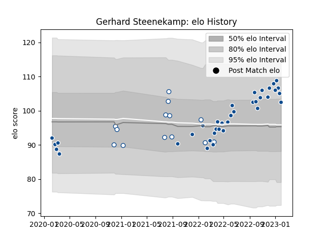

---  
layout: page  
title: Gerhard Steenekamp  
date: 2023-01-06 00:21:29.746277  
categories: player  
---
# Gerhard Steenekamp

## Positions: P

## Current elo: 105.0

## Current Percentile: 65.0

# Elo History

# Match History

| Team       |   Appearances |   Win Rate |
|:-----------|--------------:|-----------:|
| Bulls      |            31 |   0.580645 |
| Blue Bulls |            13 |   0.769231 |

| Opponent            |   Matches |   Win Rate |
|:--------------------|----------:|-----------:|
| Stormers            |         5 |   0        |
| Sharks              |         5 |   0.4      |
| Pumas               |         3 |   0.666667 |
| Free State Cheetahs |         3 |   0.666667 |
| Benetton Treviso    |         2 |   1        |
| Natal Sharks        |         2 |   0.5      |
| Western Province    |         2 |   1        |
| Ospreys             |         2 |   1        |
| Leinster            |         2 |   0.5      |
| Golden Lions        |         2 |   1        |
| Glasgow Warriors    |         2 |   0.5      |
| Griquas             |         1 |   1        |
| Highlanders         |         1 |   1        |
| Jaguares            |         1 |   0        |
| Blues               |         1 |   0        |
| Lions               |         1 |   1        |
| Munster             |         1 |   1        |
| Edinburgh           |         1 |   1        |
| Queensland Reds     |         1 |   0        |
| Scarlets            |         1 |   1        |
| Dragons             |         1 |   1        |
| Connacht            |         1 |   1        |
| Ulster              |         1 |   1        |
| Cardiff Blues       |         1 |   1        |
| Zebre               |         1 |   1        |