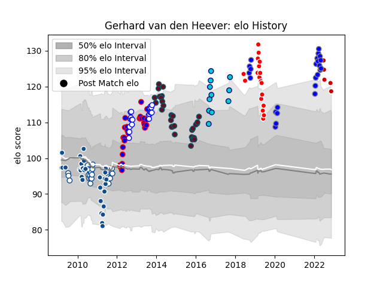

---  
layout: page  
title: Gerhard van den Heever  
date: 2023-02-02 18:42:16.972552  
categories: player  
---
# Gerhard van den Heever

## Positions: W, FB

## Country: Japan

## Current elo: 129.0

## Current Percentile: 96.0

# Elo History

# Match History

| Team                              |   Appearances |   Win Rate |
|:----------------------------------|--------------:|-----------:|
| Bulls                             |            32 |   0.75     |
| Kubota Spears Funabashi Tokyo-Bay |            32 |   0.734375 |
| Munster                           |            30 |   0.7      |
| Stormers                          |            29 |   0.724138 |
| Blue Bulls                        |            24 |   0.625    |
| Western Province                  |            20 |   0.7      |
| Sunwolves                         |            18 |   0.166667 |
| Shizuoka Blue Revs                |            12 |   0.916667 |
| Japan                             |             5 |   0.2      |

| Opponent                          |   Matches |   Win Rate |
|:----------------------------------|----------:|-----------:|
| Golden Lions                      |         8 |   0.6875   |
| Sharks                            |         8 |   0.375    |
| Free State Cheetahs               |         8 |   0.625    |
| Natal Sharks                      |         7 |   0.428571 |
| Griquas                           |         7 |   0.857143 |
| Yokohama Canon Eagles             |         6 |   0.75     |
| Queensland Reds                   |         6 |   0.333333 |
| Lions                             |         6 |   0.833333 |
| New South Wales Waratahs          |         6 |   0.666667 |
| Cheetahs                          |         6 |   1        |
| Bulls                             |         5 |   0.8      |
| Saitama Wild Knights              |         5 |   0.2      |
| Melbourne Rebels                  |         5 |   0.4      |
| Brumbies                          |         5 |   0.4      |
| Hurricanes                        |         5 |   0.8      |
| Stormers                          |         5 |   0.6      |
| Highlanders                       |         5 |   0.4      |
| Crusaders                         |         5 |   0.4      |
| Chiefs                            |         4 |   1        |
| Blue Bulls                        |         4 |   0.625    |
| Western Province                  |         4 |   0.5      |
| Ulster                            |         4 |   0.75     |
| Black Rams Tokyo                  |         4 |   1        |
| Urayasu D-Rocks                   |         4 |   1        |
| Scarlets                          |         4 |   0.5      |
| Blues                             |         3 |   0.333333 |
| Mie Honda Heat                    |         3 |   1        |
| Leopards                          |         3 |   1        |
| Cardiff Blues                     |         3 |   1        |
| Toshiba Brave Lupus Tokyo         |         3 |   1        |
| Green Rockets Tokatsu             |         3 |   1        |
| Pumas                             |         3 |   0.666667 |
| Kobelco Kobe Steelers             |         3 |   0.666667 |
| Tokyo Sungoliath                  |         2 |   0.5      |
| Shizuoka Blue Revs                |         2 |   0.5      |
| Southern Kings                    |         2 |   1        |
| Western Force                     |         2 |   1        |
| Toyota Verblitz                   |         2 |   0.5      |
| Benetton Treviso                  |         2 |   1        |
| Zebre                             |         2 |   1        |
| Glasgow Warriors                  |         2 |   0.5      |
| Connacht                          |         2 |   0.5      |
| Leinster                          |         2 |   0.5      |
| Dragons                           |         2 |   0.5      |
| Edinburgh                         |         2 |   1        |
| France                            |         2 |   0        |
| Clermont Auvergne                 |         1 |   0        |
| Coca-Cola Red Sparks              |         1 |   1        |
| Uruguay                           |         1 |   1        |
| England                           |         1 |   0        |
| Toyota Industries Shuttles Aichi  |         1 |   1        |
| Ospreys                           |         1 |   0        |
| New Zealand                       |         1 |   0        |
| Stade Toulousain                  |         1 |   1        |
| Hino Red Dolphins                 |         1 |   1        |
| Jaguares                          |         1 |   0        |
| Kubota Spears Funabashi Tokyo-Bay |         1 |   1        |
| Saracens                          |         1 |   1        |
| Sale Sharks                       |         1 |   1        |
| Munakata Sanix Blues              |         1 |   1        |
| NTT Docomo Red Hurricanes Osaka   |         1 |   1        |
| Hanazono Kintetsu Liners          |         1 |   1        |