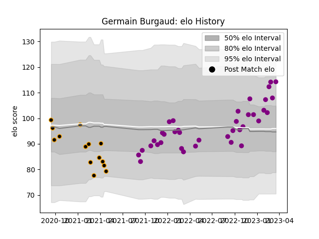

---  
layout: page  
title: Germain Burgaud  
date: 2023-03-21 18:14:47.045281  
categories: player  
---
# Germain Burgaud

Last updated: 2023-03-21
## Positions: FL

## Current elo: 114.0

## Current Percentile: 78.0

# Elo History

# Match History

| Team             |   Appearances |   Win Rate |
|:-----------------|--------------:|-----------:|
| Soyaux-Angouleme |            37 |   0.513514 |
| Chambery         |            14 |   0.214286 |

| Opponent                   |   Matches |   Win Rate |
|:---------------------------|----------:|-----------:|
| Massy                      |         5 |   0.8      |
| Dijon                      |         4 |   0.25     |
| Aubenas                    |         3 |   0.666667 |
| Bourgoin-Jallieu           |         3 |   0.666667 |
| Nice                       |         3 |   0        |
| Dax                        |         3 |   0        |
| Agen                       |         2 |   0.5      |
| Tarbes                     |         2 |   0.5      |
| Suresnes                   |         2 |   1        |
| Nevers                     |         2 |   0        |
| Montauban                  |         2 |   0.5      |
| US Bressane                |         2 |   0        |
| Colomiers                  |         2 |   0        |
| Chambery                   |         2 |   0        |
| Carcassonne                |         2 |   1        |
| Blagnac                    |         2 |   0.5      |
| Beziers                    |         2 |   0.5      |
| Albi                       |         1 |   1        |
| Mont-de-Marsan             |         1 |   0        |
| Cognac Saint Jean d'Angély |         1 |   1        |
| Narbonne                   |         1 |   1        |
| Oyonnax                    |         1 |   0        |
| Provence Rugby             |         1 |   0        |
| Rouen                      |         1 |   0        |
| Grenoble                   |         1 |   1        |