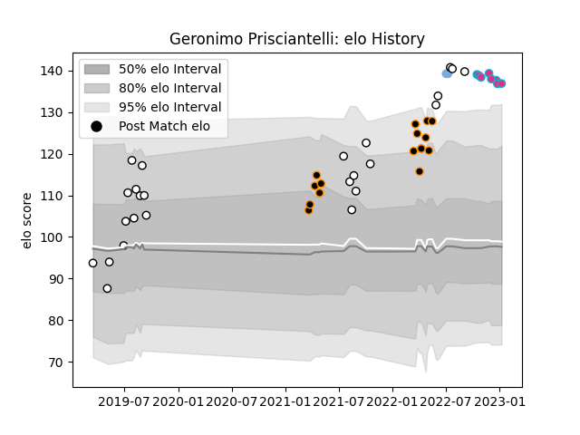

---  
layout: page  
title: Geronimo Prisciantelli  
date: 2023-02-02 18:42:41.269656  
categories: player  
---
# Geronimo Prisciantelli

## Positions: FH, FB

## Country: Argentina

## Current elo: 138.0

## Current Percentile: 96.0

# Elo History

# Match History

| Team        |   Appearances |   Win Rate |
|:------------|--------------:|-----------:|
| CASI        |            25 |       0.44 |
| Jaguares XV |            15 |       0.8  |
| Zebre       |            11 |       0    |
| Argentina   |             2 |       1    |

| Opponent             |   Matches |   Win Rate |
|:---------------------|----------:|-----------:|
| Hindu                |         4 |   0.25     |
| Cafeteros Pro        |         4 |   1        |
| San Luis             |         4 |   0.5      |
| Pucara               |         3 |   0.333333 |
| Olimpia Lions        |         3 |   1        |
| Selknam              |         3 |   0.333333 |
| Cobras               |         3 |   1        |
| Alumni               |         2 |   0.5      |
| Newman               |         2 |   0        |
| Atlético del Rosario |         2 |   1        |
| Regatas Bella Vista  |         2 |   0.5      |
| Edinburgh            |         2 |   0        |
| Bristol Rugby        |         2 |   0        |
| Belgrano             |         2 |   0.5      |
| Penarol Rugby        |         2 |   0.5      |
| SIC                  |         1 |   1        |
| Portugal             |         1 |   1        |
| Scarlets             |         1 |   0        |
| Toulon               |         1 |   0        |
| Los Tilos            |         1 |   1        |
| Ospreys              |         1 |   0        |
| La Plata             |         1 |   0        |
| Glasgow Warriors     |         1 |   0        |
| Georgia              |         1 |   1        |
| Dragons              |         1 |   0        |
| CUBA                 |         1 |   0        |
| Benetton Treviso     |         1 |   0        |
| Ulster               |         1 |   0        |