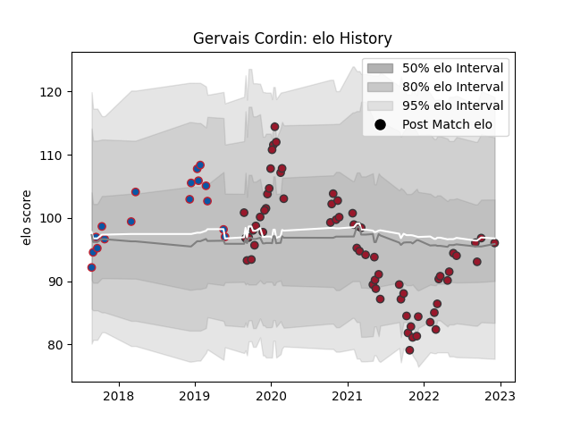

---  
layout: page  
title: Gervais Cordin  
date: 2023-01-21 15:44:59.865900  
categories: player  
---
# Gervais Cordin

## Positions: FB, W

## Current elo: 104.0

## Current Percentile: 70.0

# Elo History

# Match History

| Team     |   Appearances |   Win Rate |
|:---------|--------------:|-----------:|
| Toulon   |            69 |   0.594203 |
| Grenoble |            19 |   0.473684 |

| Opponent             |   Matches |   Win Rate |
|:---------------------|----------:|-----------:|
| Brive                |         6 |   0.5      |
| Bayonne              |         6 |   0.666667 |
| Stade Toulousain     |         6 |   0.416667 |
| Pau                  |         6 |   0.75     |
| Lyon                 |         6 |   0.333333 |
| Agen                 |         5 |   0.8      |
| Racing 92            |         5 |   0.4      |
| Montpellier Herault  |         5 |   0.4      |
| La Rochelle          |         5 |   0.4      |
| Bordeaux Begles      |         4 |   0.5      |
| Clermont Auvergne    |         4 |   0.25     |
| Stade Francais Paris |         4 |   0.5      |
| Castres Olympique    |         3 |   0.666667 |
| Perpignan            |         3 |   0.333333 |
| Biarritz Olympique   |         3 |   1        |
| Scarlets             |         2 |   1        |
| Zebre                |         2 |   1        |
| London Irish         |         2 |   1        |
| Massy                |         1 |   1        |
| Mont-de-Marsan       |         1 |   1        |
| Bristol Rugby        |         1 |   0        |
| Narbonne             |         1 |   1        |
| Nevers               |         1 |   0        |
| Bath Rugby           |         1 |   1        |
| Beziers              |         1 |   1        |
| Harlequins           |         1 |   0        |
| Dax                  |         1 |   1        |
| Benetton Treviso     |         1 |   0        |
| Carcassonne          |         1 |   1        |