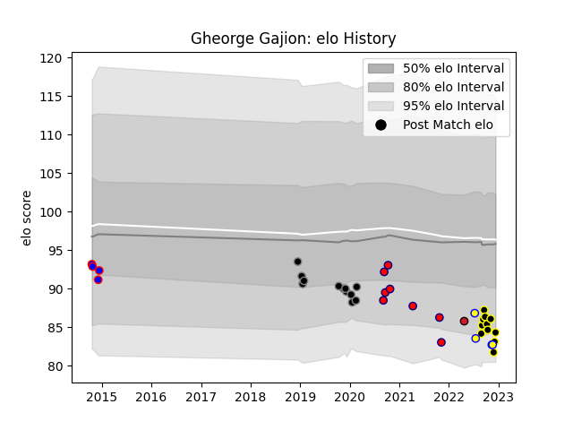

---  
layout: page  
title: Gheorge Gajion  
date: 2022-12-09 13:07:40.919428  
categories: player  
---
# Gheorge Gajion

## Positions: P

## Country: Romania

## Current elo: 83.0

## Current Percentile: 6.0

# Elo History

# Match History

| Team           |   Appearances |   Win Rate |
|:---------------|--------------:|-----------:|
| Ospreys        |            12 |   0.166667 |
| Mont-de-Marsan |            10 |   0.7      |
| Aurillac       |             8 |   0.25     |
| Romania        |             4 |   0.25     |
| Rovigo         |             4 |   0        |
| Oyonnax        |             1 |   1        |

| Opponent             |   Matches |   Win Rate |
|:---------------------|----------:|-----------:|
| Nevers               |         4 |   0.5      |
| Uruguay              |         3 |   0.333333 |
| Grenoble             |         3 |   0.333333 |
| Oyonnax              |         2 |   0.5      |
| Vannes               |         2 |   0.5      |
| Colomiers            |         2 |   0.5      |
| Munster              |         2 |   0        |
| Agen                 |         1 |   0        |
| Ulster               |         1 |   1        |
| Stade Francais Paris |         1 |   0        |
| Soyaux-Angouleme     |         1 |   1        |
| Saracens             |         1 |   0        |
| Samoa                |         1 |   0        |
| Rouen                |         1 |   0        |
| Racing 92            |         1 |   0        |
| Pau                  |         1 |   0        |
| Narbonne             |         1 |   1        |
| Aurillac             |         1 |   1        |
| Montauban            |         1 |   0        |
| London Irish         |         1 |   0        |
| Leinster             |         1 |   0        |
| Glasgow Warriors     |         1 |   0        |
| Cheetahs             |         1 |   0        |
| Cardiff Blues        |         1 |   0        |
| Biarritz Olympique   |         1 |   1        |
| Beziers              |         1 |   0        |
| Benetton Treviso     |         1 |   1        |
| Worcester Warriors   |         1 |   0        |