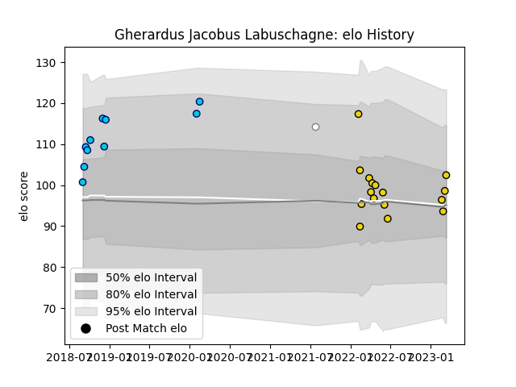

---  
layout: page  
title: Gherardus Jacobus Labuschagne  
date: 2023-03-21 18:28:58.825953  
categories: player  
---
# Gherardus Jacobus Labuschagne

Last updated: 2023-03-21
## Positions: W, FB

## Current elo: 102.0

## Current Percentile: 58.0

# Elo History

# Match History

| Team               |   Appearances |   Win Rate |
|:-------------------|--------------:|-----------:|
| Houston SaberCats  |            16 |        0.5 |
| Shizuoka Blue Revs |            10 |        0.8 |
| Pumas              |             1 |        0   |

| Opponent                          |   Matches |   Win Rate |
|:----------------------------------|----------:|-----------:|
| Dallas Jackals                    |         3 |        1   |
| Seattle Seawolves                 |         3 |        0   |
| Austin Gilgronis                  |         2 |        0   |
| L. A. Giltinis                    |         2 |        0.5 |
| San Diego Legion                  |         1 |        1   |
| Utah Warriors                     |         1 |        1   |
| Urayasu D-Rocks                   |         1 |        1   |
| Toyota Verblitz                   |         1 |        1   |
| Toshiba Brave Lupus Tokyo         |         1 |        1   |
| Toronto Arrows                    |         1 |        1   |
| Tokyo Sungoliath                  |         1 |        0   |
| Rugby New York                    |         1 |        0   |
| Saitama Wild Knights              |         1 |        0   |
| Coca-Cola Red Sparks              |         1 |        1   |
| R.U. New York                     |         1 |        0   |
| NTT Docomo Red Hurricanes Osaka   |         1 |        1   |
| NOLA Gold                         |         1 |        1   |
| Mie Honda Heat                    |         1 |        1   |
| Kubota Spears Funabashi Tokyo-Bay |         1 |        1   |
| Hino Red Dolphins                 |         1 |        1   |
| Western Province                  |         1 |        0   |