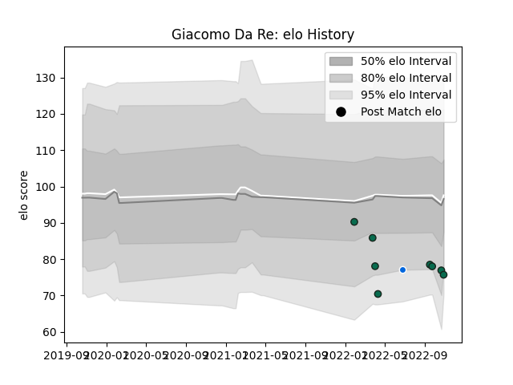

---  
layout: page  
title: Giacomo Da Re  
date: 2023-03-06 11:26:20.826215  
categories: player  
---
# Giacomo Da Re

## Positions: FB, FH

## Country: Italy

## Current elo: 76.0

## Current Percentile: 15.0

# Elo History

# Match History

| Team                |   Appearances |   Win Rate |
|:--------------------|--------------:|-----------:|
| Mogliano Rugby 1969 |            20 |     0.45   |
| Benetton Treviso    |             8 |     0.3125 |
| Italy               |             1 |     1      |

| Opponent                 |   Matches |   Win Rate |
|:-------------------------|----------:|-----------:|
| Lazio Rugby              |         3 |   0.666667 |
| Glasgow Warriors         |         2 |   0.5      |
| Rugby Lyons Piacenza     |         2 |   0.5      |
| Rugby Colorno 1975       |         2 |   1        |
| Rugby Calvisano          |         2 |   0.5      |
| Conad Valorugby Emilia   |         2 |   0        |
| Rugby Viadana 1970       |         2 |   0.5      |
| Femi CZ Rugby Rovigo     |         2 |   0        |
| I Medicei                |         1 |   0        |
| Kawasaki Robot Calvisano |         1 |   0        |
| Lafert San Dona          |         1 |   1        |
| Fiamme Oro Roma          |         1 |   1        |
| Leinster                 |         1 |   0        |
| Munster                  |         1 |   0        |
| Perpignan                |         1 |   1        |
| Petrarca Padova Rugby    |         1 |   0        |
| Portugal                 |         1 |   1        |
| Dragons                  |         1 |   0.5      |
| Connacht                 |         1 |   0        |
| Bulls                    |         1 |   0        |