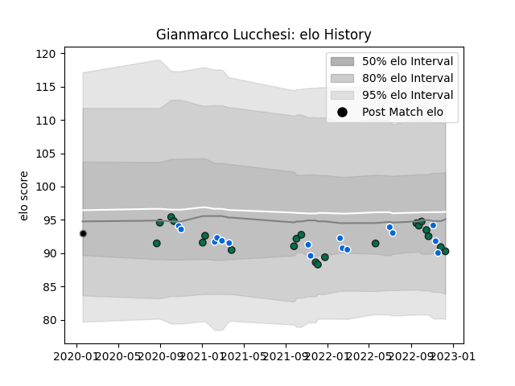

---  
layout: page  
title: Gianmarco Lucchesi  
date: 2022-12-14 11:12:05.367010  
categories: player  
---
# Gianmarco Lucchesi

## Positions: H

## Country: Italy

## Current elo: 90.0

## Current Percentile: 29.0

# Elo History

# Match History

| Team             |   Appearances |   Win Rate |
|:-----------------|--------------:|-----------:|
| Benetton Treviso |            21 |   0.428571 |
| Italy            |            16 |   0.1875   |
| Calvisano        |             1 |   0        |

| Opponent             |   Matches |   Win Rate |
|:---------------------|----------:|-----------:|
| Zebre                |         5 |   0.4      |
| Edinburgh            |         4 |   0.5      |
| England              |         3 |   0        |
| Glasgow Warriors     |         3 |   0.666667 |
| Ireland              |         3 |   0        |
| Cardiff Blues        |         2 |   0.5      |
| France               |         2 |   0        |
| Leinster             |         2 |   0        |
| Scarlets             |         1 |   1        |
| Ulster               |         1 |   0        |
| Stormers             |         1 |   1        |
| Stade Francais Paris |         1 |   0        |
| South Africa         |         1 |   0        |
| Scotland             |         1 |   0        |
| Argentina            |         1 |   0        |
| Samoa                |         1 |   1        |
| Romania              |         1 |   1        |
| Ospreys              |         1 |   0        |
| Australia            |         1 |   1        |
| Georgia              |         1 |   0        |
| Bulls                |         1 |   0        |
| New Zealand          |         1 |   0        |