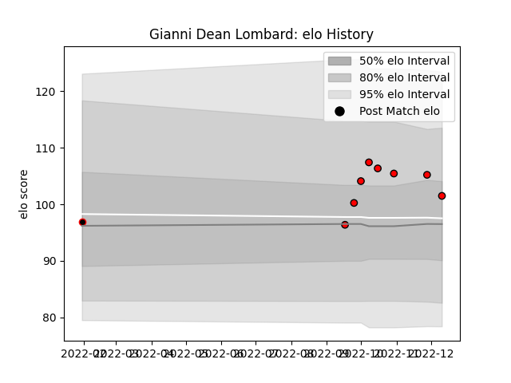

---  
layout: page  
title: Gianni Dean Lombard  
date: 2023-01-06 00:24:48.905798  
categories: player  
---
# Gianni Dean Lombard

## Positions: FH

## Current elo: 109.0

## Current Percentile: 71.0

# Elo History

# Match History

| Team                            |   Appearances |   Win Rate |
|:--------------------------------|--------------:|-----------:|
| Lions                           |            10 |       0.45 |
| NTT Docomo Red Hurricanes Osaka |             4 |       0    |
| Golden Lions                    |             2 |       0    |

| Opponent              |   Matches |   Win Rate |
|:----------------------|----------:|-----------:|
| Dragons               |         2 |       0.75 |
| Stormers              |         2 |       0    |
| Bulls                 |         1 |       0    |
| Cardiff Blues         |         1 |       1    |
| Edinburgh             |         1 |       1    |
| Natal Sharks          |         1 |       0    |
| Ospreys               |         1 |       1    |
| Saitama Wild Knights  |         1 |       0    |
| Sharks                |         1 |       0    |
| Shizuoka Blue Revs    |         1 |       0    |
| Tokyo Sungoliath      |         1 |       0    |
| Ulster                |         1 |       0    |
| Western Province      |         1 |       0    |
| Yokohama Canon Eagles |         1 |       0    |