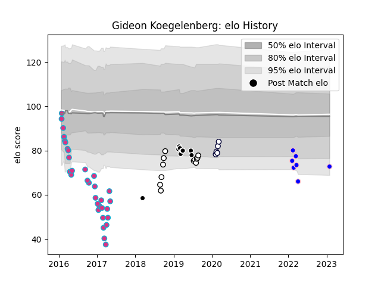

---  
layout: page  
title: Gideon Koegelenberg  
date: 2023-02-02 19:02:09.415553  
categories: player  
---
# Gideon Koegelenberg

## Positions: L

## Current elo: 73.0

## Current Percentile: 4.0

# Elo History

# Match History

| Team              |   Appearances |   Win Rate |
|:------------------|--------------:|-----------:|
| Zebre             |            32 |   0.09375  |
| Natal Sharks      |            12 |   0.75     |
| Sharks            |             9 |   0.555556 |
| Kurita Water Gush |             7 |   0.285714 |
| Melbourne Rebels  |             5 |   0.6      |

| Opponent                         |   Matches |   Win Rate |
|:---------------------------------|----------:|-----------:|
| Munster                          |         4 |   0        |
| Ulster                           |         4 |   0        |
| Connacht                         |         4 |   0.25     |
| Dragons                          |         3 |   0.666667 |
| Leinster                         |         3 |   0        |
| Glasgow Warriors                 |         3 |   0        |
| Western Province                 |         2 |   0.5      |
| Golden Lions                     |         2 |   1        |
| Munakata Sanix Blues             |         2 |   0        |
| Stade Toulousain                 |         2 |   0        |
| Blue Bulls                       |         2 |   1        |
| Stormers                         |         2 |   0.5      |
| Griquas                          |         2 |   0.5      |
| Sunwolves                        |         2 |   1        |
| Pumas                            |         2 |   0.5      |
| Free State Cheetahs              |         2 |   1        |
| Chugoku Red Regulions            |         2 |   0.5      |
| Bulls                            |         2 |   0        |
| Brumbies                         |         2 |   0        |
| Wasps                            |         2 |   0        |
| Scarlets                         |         2 |   0        |
| Toyota Industries Shuttles Aichi |         1 |   0        |
| Shimizu Blue Sharks              |         1 |   0        |
| Sharks                           |         1 |   0        |
| Benetton Treviso                 |         1 |   0        |
| Ospreys                          |         1 |   0        |
| New South Wales Waratahs         |         1 |   1        |
| NTT Docomo Red Hurricanes Osaka  |         1 |   1        |
| Melbourne Rebels                 |         1 |   1        |
| Highlanders                      |         1 |   1        |
| Gloucester Rugby                 |         1 |   0        |
| Edinburgh                        |         1 |   0        |
| Cardiff Blues                    |         1 |   0        |
| Blues                            |         1 |   1        |
| Lions                            |         1 |   1        |