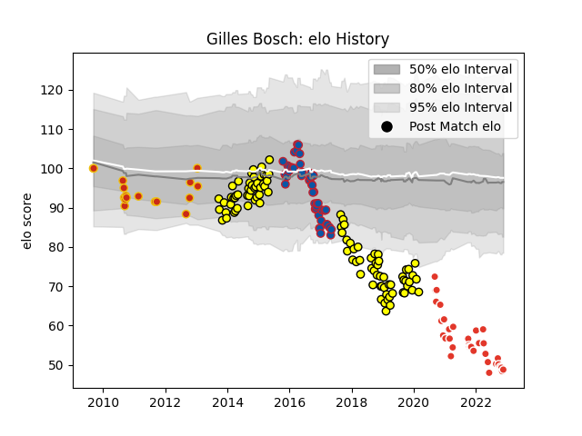

---  
layout: page  
title: Gilles Bosch  
date: 2023-03-21 18:33:27.403090  
categories: player  
---
# Gilles Bosch

Last updated: 2023-03-21
## Positions: FH

## Current elo: 70.0

## Current Percentile: 4.0

# Elo History

# Match History

| Team               |   Appearances |   Win Rate |
|:-------------------|--------------:|-----------:|
| Carcassonne        |           119 |   0.44958  |
| Biarritz Olympique |            57 |   0.508772 |
| Grenoble           |            48 |   0.322917 |
| Perpignan          |            19 |   0.657895 |

| Opponent                   |   Matches |   Win Rate |
|:---------------------------|----------:|-----------:|
| Aurillac                   |        12 |   0.5      |
| Colomiers                  |        10 |   0.6      |
| Beziers                    |        10 |   0.5      |
| Biarritz Olympique         |        10 |   0.6      |
| Agen                       |         9 |   0.5      |
| Perpignan                  |         9 |   0.333333 |
| Pau                        |         9 |   0.222222 |
| Mont-de-Marsan             |         9 |   0.277778 |
| Vannes                     |         8 |   0.625    |
| La Rochelle                |         8 |   0.375    |
| Montauban                  |         8 |   0.375    |
| Bayonne                    |         8 |   0.5625   |
| Nevers                     |         7 |   0.5      |
| Oyonnax                    |         7 |   0.714286 |
| Massy                      |         7 |   0.428571 |
| Lyon                       |         6 |   0.166667 |
| Racing 92                  |         6 |   0.333333 |
| Soyaux-Angouleme           |         6 |   0.75     |
| Narbonne                   |         6 |   0.333333 |
| Brive                      |         6 |   0.333333 |
| Bourgoin-Jallieu           |         6 |   0.666667 |
| Bordeaux Begles            |         5 |   0        |
| Dax                        |         5 |   1        |
| Clermont Auvergne          |         5 |   0        |
| Stade Toulousain           |         5 |   0.2      |
| Toulon                     |         4 |   0.375    |
| Provence Rugby             |         4 |   0.625    |
| Montpellier Herault        |         4 |   0        |
| Stade Francais Paris       |         4 |   0.5      |
| Grenoble                   |         4 |   0.5      |
| Rouen                      |         4 |   0.5      |
| US Bressane                |         4 |   0.75     |
| Carcassonne                |         3 |   0.666667 |
| Castres Olympique          |         3 |   0        |
| Albi                       |         3 |   0.333333 |
| Bizkaia Gernika RT         |         2 |   1        |
| Rovigo                     |         2 |   1        |
| Ospreys                    |         2 |   0        |
| Newcastle Falcons          |         2 |   0.5      |
| Tarbes                     |         2 |   0.5      |
| Edinburgh                  |         2 |   0.5      |
| Valence Romans Drome Rugby |         2 |   0.5      |
| Roval Drome XV             |         1 |   1        |
| London Irish               |         1 |   1        |
| Auch                       |         1 |   0        |
| Wasps                      |         1 |   0        |
| Zebre                      |         1 |   1        |