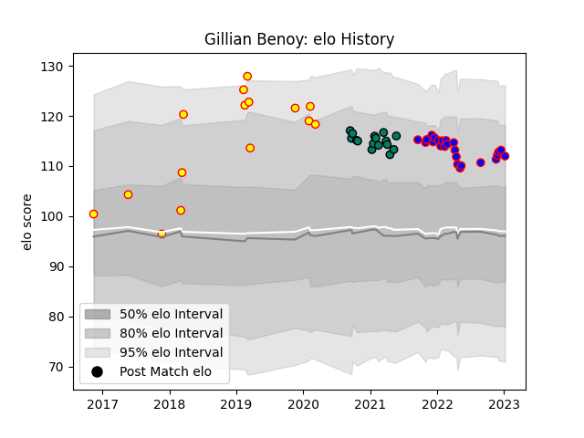

---  
layout: page  
title: Gillian Benoy  
date: 2022-11-22 11:43:19.944756  
categories: player  
---
# Gillian Benoy

## Positions: FL, L

## Country: Belgium

## Current elo: 92.0

## Current Percentile: 28.0

# Elo History

# Match History

| Team     |   Appearances |   Win Rate |
|:---------|--------------:|-----------:|
| Beziers  |            19 |   0.289474 |
| Belgium  |            15 |   0.333333 |
| Suresnes |            14 |   0.285714 |

| Opponent                   |   Matches |   Win Rate |
|:---------------------------|----------:|-----------:|
| US Bressane                |         3 |   0        |
| Spain                      |         3 |   0.333333 |
| Portugal                   |         3 |   0.333333 |
| Vannes                     |         2 |   0        |
| Narbonne                   |         2 |   1        |
| Aubenas                    |         2 |   0.5      |
| Oyonnax                    |         2 |   0.25     |
| Grenoble                   |         2 |   0.5      |
| Germany                    |         2 |   1        |
| Romania                    |         2 |   0        |
| Cognac Saint Jean d'Angély |         2 |   0        |
| Rouen                      |         2 |   0.5      |
| Carcassonne                |         2 |   0        |
| Russia                     |         2 |   0.5      |
| Provence Rugby             |         1 |   0        |
| Tarbes                     |         1 |   0        |
| Nice                       |         1 |   0        |
| Nevers                     |         1 |   0        |
| Agen                       |         1 |   1        |
| Montauban                  |         1 |   0        |
| Mont-de-Marsan             |         1 |   0        |
| Hong Kong                  |         1 |   0        |
| Georgia                    |         1 |   0        |
| Dijon                      |         1 |   1        |
| Dax                        |         1 |   1        |
| Chambery                   |         1 |   0        |
| Brazil                     |         1 |   0        |
| Blagnac                    |         1 |   0        |
| Bayonne                    |         1 |   1        |
| Aurillac                   |         1 |   0        |
| Massy                      |         1 |   0        |