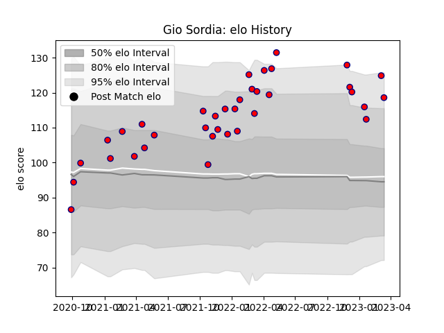

---  
layout: page  
title: Gio Sordia  
date: 2022-12-09 13:11:55.961654  
categories: player  
---
# Gio Sordia

## Positions: FL

## Current elo: 113.0

## Current Percentile: 94.0

# Elo History

# Match History

| Team                       |   Appearances |   Win Rate |
|:---------------------------|--------------:|-----------:|
| Cognac Saint Jean d'Angély |            31 |   0.403226 |

| Opponent                   |   Matches |   Win Rate |
|:---------------------------|----------:|-----------:|
| Bourgoin-Jallieu           |         4 |   0.25     |
| Dijon                      |         3 |   1        |
| Nice                       |         3 |   0.333333 |
| Suresnes                   |         3 |   0.333333 |
| Tarbes                     |         3 |   0.166667 |
| Aubenas                    |         2 |   0.5      |
| Blagnac                    |         2 |   0.5      |
| Chambery                   |         2 |   0.5      |
| Dax                        |         2 |   1        |
| Massy                      |         2 |   0        |
| Soyaux-Angouleme           |         2 |   0        |
| Albi                       |         1 |   1        |
| US Bressane                |         1 |   0        |
| Valence Romans Drome Rugby |         1 |   0        |