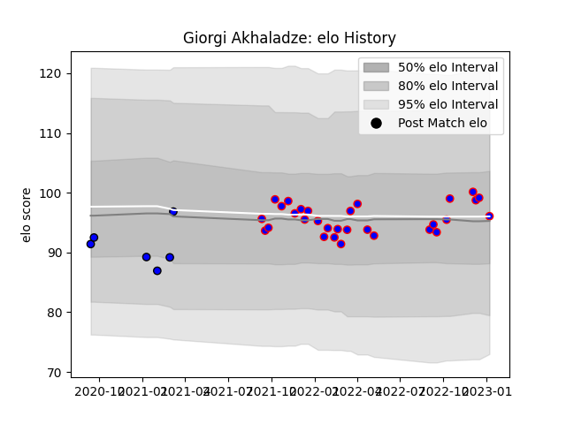

---  
layout: page  
title: Giorgi Akhaladze  
date: 2023-01-13 11:28:10.568820  
categories: player  
---
# Giorgi Akhaladze

## Positions: P

## Current elo: 96.0

## Current Percentile: 60.0

# Elo History

# Match History

| Team    |   Appearances |   Win Rate |
|:--------|--------------:|-----------:|
| Beziers |            30 |   0.5      |
| Massy   |             6 |   0.333333 |

| Opponent           |   Matches |   Win Rate |
|:-------------------|----------:|-----------:|
| US Bressane        |         4 |   0.25     |
| Nevers             |         3 |   0.333333 |
| Montauban          |         3 |   0.666667 |
| Agen               |         2 |   1        |
| Colomiers          |         2 |   0.5      |
| Rouen              |         2 |   0.5      |
| Provence Rugby     |         2 |   0        |
| Narbonne           |         2 |   1        |
| Vannes             |         2 |   0.5      |
| Carcassonne        |         2 |   0        |
| Bayonne            |         2 |   0.5      |
| Grenoble           |         1 |   1        |
| Aubenas            |         1 |   1        |
| Mont-de-Marsan     |         1 |   1        |
| Chambery           |         1 |   0        |
| Blagnac            |         1 |   0        |
| Oyonnax            |         1 |   0        |
| Biarritz Olympique |         1 |   1        |
| Tarbes             |         1 |   0        |
| Aurillac           |         1 |   0        |
| Massy              |         1 |   1        |