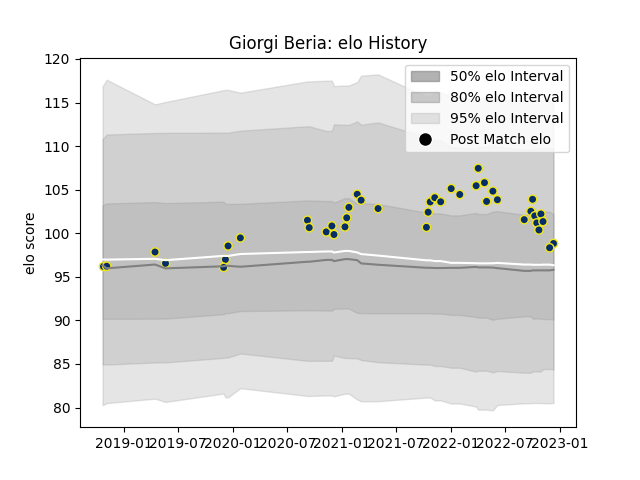

---  
layout: page  
title: Giorgi Beria  
date: 2022-12-14 11:33:16.514808  
categories: player  
---
# Giorgi Beria

## Positions: P

## Current elo: 99.0

## Current Percentile: 60.0

# Elo History

# Match History

| Team              |   Appearances |   Win Rate |
|:------------------|--------------:|-----------:|
| Clermont Auvergne |            42 |   0.583333 |

| Opponent             |   Matches |   Win Rate |
|:---------------------|----------:|-----------:|
| Stade Francais Paris |         4 |   0.5      |
| Castres Olympique    |         4 |   0.5      |
| Montpellier Herault  |         4 |   0.5      |
| Stade Toulousain     |         4 |   0.5      |
| Toulon               |         3 |   0.333333 |
| Bayonne              |         3 |   0.333333 |
| Pau                  |         3 |   0.666667 |
| Bordeaux Begles      |         2 |   0.5      |
| Brive                |         2 |   1        |
| La Rochelle          |         2 |   0.5      |
| Bath Rugby           |         2 |   1        |
| Perpignan            |         2 |   0.5      |
| Timisoara Saracens   |         1 |   1        |
| Stormers             |         1 |   1        |
| Agen                 |         1 |   1        |
| Racing 92            |         1 |   0        |
| Grenoble             |         1 |   0.5      |
| Biarritz Olympique   |         1 |   1        |
| Lyon                 |         1 |   1        |