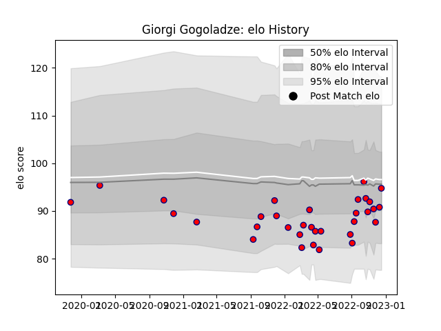

---  
layout: page  
title: Giorgi Gogoladze  
date: 2022-12-14 11:24:35.769784  
categories: player  
---
# Giorgi Gogoladze

## Positions: W, FB

## Current elo: 91.0

## Current Percentile: 17.0

# Elo History

# Match History

| Team     |   Appearances |   Win Rate |
|:---------|--------------:|-----------:|
| Aurillac |            32 |    0.46875 |

| Opponent           |   Matches |   Win Rate |
|:-------------------|----------:|-----------:|
| Oyonnax            |         4 |   0.25     |
| Carcassonne        |         3 |   0.333333 |
| Montauban          |         2 |   1        |
| Mont-de-Marsan     |         2 |   0        |
| Rouen              |         2 |   0.5      |
| Provence Rugby     |         2 |   0.5      |
| Nevers             |         2 |   1        |
| Vannes             |         2 |   0.5      |
| Grenoble           |         2 |   0        |
| Colomiers          |         2 |   0        |
| Massy              |         1 |   1        |
| Bayonne            |         1 |   0        |
| Narbonne           |         1 |   1        |
| Perpignan          |         1 |   0        |
| Biarritz Olympique |         1 |   0        |
| Beziers            |         1 |   1        |
| Soyaux-Angouleme   |         1 |   1        |
| US Bressane        |         1 |   1        |
| Agen               |         1 |   1        |