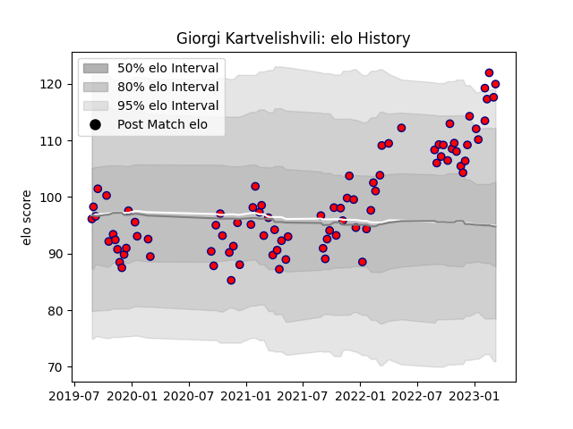

---  
layout: page  
title: Giorgi Kartvelishvili  
date: 2022-12-18 16:12:54.585769  
categories: player  
---
# Giorgi Kartvelishvili

## Positions: P

## Current elo: 115.0

## Current Percentile: 92.0

# Elo History

# Match History

| Team     |   Appearances |   Win Rate |
|:---------|--------------:|-----------:|
| Aurillac |            60 |      0.525 |

| Opponent                   |   Matches |   Win Rate |
|:---------------------------|----------:|-----------:|
| Provence Rugby             |         6 |   0.5      |
| Beziers                    |         5 |   0.6      |
| Colomiers                  |         4 |   0.75     |
| Grenoble                   |         4 |   0.25     |
| Mont-de-Marsan             |         4 |   0.25     |
| Montauban                  |         4 |   0.5      |
| Soyaux-Angouleme           |         4 |   0.5      |
| Vannes                     |         3 |   0.666667 |
| Biarritz Olympique         |         3 |   0        |
| Carcassonne                |         3 |   0.666667 |
| Nevers                     |         3 |   0.666667 |
| Oyonnax                    |         3 |   0.666667 |
| Rouen                      |         3 |   1        |
| US Bressane                |         2 |   0.5      |
| Agen                       |         2 |   0.5      |
| Perpignan                  |         2 |   0.25     |
| Narbonne                   |         2 |   1        |
| Bayonne                    |         1 |   0        |
| Massy                      |         1 |   1        |
| Valence Romans Drome Rugby |         1 |   0        |