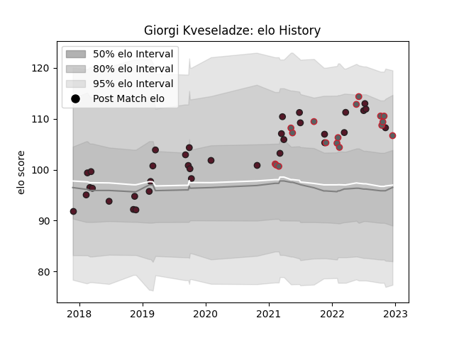

---  
layout: page  
title: Giorgi Kveseladze  
date: 2022-12-18 16:24:17.095908  
categories: player  
---
# Giorgi Kveseladze

## Positions: C, W

## Country: Georgia

## Current elo: 107.0

## Current Percentile: 83.0

# Elo History

# Match History

| Team             |   Appearances |   Win Rate |
|:-----------------|--------------:|-----------:|
| Georgia          |            35 |   0.7      |
| Gloucester Rugby |            17 |   0.588235 |

| Opponent                 |   Matches |   Win Rate |
|:-------------------------|----------:|-----------:|
| Romania                  |         5 |   1        |
| Spain                    |         4 |   1        |
| Russia                   |         3 |   1        |
| Bristol Rugby            |         3 |   0.333333 |
| London Irish             |         3 |   0.666667 |
| Portugal                 |         2 |   1        |
| Northampton Saints       |         2 |   0.5      |
| Scotland                 |         2 |   0        |
| Italy                    |         2 |   0.5      |
| Uruguay                  |         2 |   1        |
| Fiji                     |         2 |   0.25     |
| Exeter Chiefs            |         2 |   0.5      |
| Belgium                  |         2 |   1        |
| United States of America |         1 |   1        |
| Saracens                 |         1 |   1        |
| Tonga                    |         1 |   1        |
| Wales                    |         1 |   0        |
| South Africa             |         1 |   0        |
| Wasps                    |         1 |   1        |
| Argentina                |         1 |   0        |
| Newcastle Falcons        |         1 |   1        |
| Samoa                    |         1 |   1        |
| Australia                |         1 |   0        |
| Netherlands              |         1 |   1        |
| Leinster                 |         1 |   0        |
| Japan                    |         1 |   0        |
| Harlequins               |         1 |   0        |
| Germany                  |         1 |   1        |
| France                   |         1 |   0        |
| Bath Rugby               |         1 |   1        |
| Worcester Warriors       |         1 |   1        |