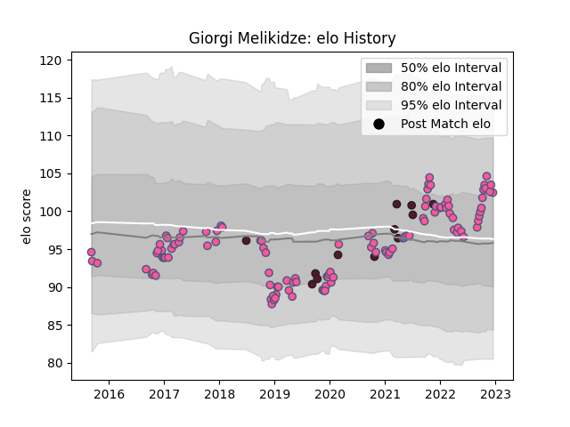

---  
layout: page  
title: Giorgi Melikidze  
date: 2022-12-18 16:24:40.223665  
categories: player  
---
# Giorgi Melikidze

## Positions: P

## Country: Georgia

## Current elo: 103.0

## Current Percentile: 78.0

# Elo History

# Match History

| Team                 |   Appearances |   Win Rate |
|:---------------------|--------------:|-----------:|
| Stade Francais Paris |           113 |   0.473451 |
| Georgia              |            12 |   0.5      |

| Opponent            |   Matches |   Win Rate |
|:--------------------|----------:|-----------:|
| Pau                 |         9 |   0.777778 |
| Brive               |         9 |   0.444444 |
| Clermont Auvergne   |         8 |   0.3125   |
| Stade Toulousain    |         8 |   0.5625   |
| Castres Olympique   |         8 |   0.75     |
| Montpellier Herault |         8 |   0.3125   |
| Toulon              |         7 |   0        |
| Lyon                |         6 |   0.333333 |
| La Rochelle         |         6 |   0.333333 |
| Bordeaux Begles     |         5 |   0.2      |
| Racing 92           |         5 |   0.4      |
| Edinburgh           |         4 |   0.5      |
| Perpignan           |         4 |   1        |
| Bayonne             |         4 |   0.75     |
| Grenoble            |         3 |   0.333333 |
| Timisoara Saracens  |         2 |   1        |
| Scotland            |         2 |   0        |
| Ospreys             |         2 |   0.5      |
| Agen                |         2 |   1        |
| Zebre               |         2 |   0.5      |
| Krasny Yar          |         2 |   0.5      |
| Harlequins          |         2 |   0.5      |
| Biarritz Olympique  |         2 |   0.5      |
| Bristol Rugby       |         2 |   0        |
| Australia           |         1 |   0        |
| South Africa        |         1 |   0        |
| Worcester Warriors  |         1 |   0        |
| Uruguay             |         1 |   1        |
| Belgium             |         1 |   1        |
| Russia              |         1 |   1        |
| France              |         1 |   0        |
| Netherlands         |         1 |   1        |
| Romania             |         1 |   1        |
| Portugal            |         1 |   1        |
| Japan               |         1 |   0        |
| Lions               |         1 |   0        |
| London Irish        |         1 |   1        |