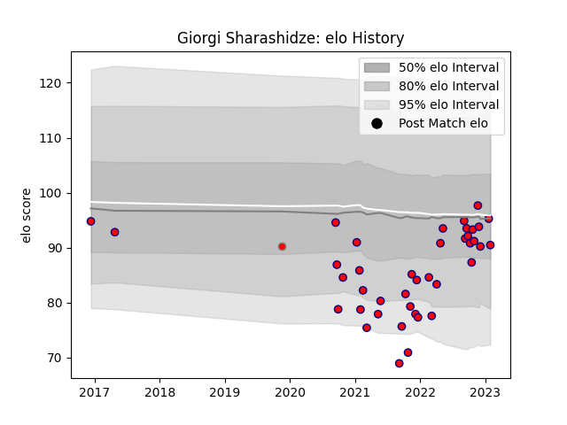

---  
layout: page  
title: Giorgi Sharashidze  
date: 2022-12-09 13:04:18.967225  
categories: player  
---
# Giorgi Sharashidze

## Positions: P

## Current elo: 81.0

## Current Percentile: 6.0

# Elo History

# Match History

| Team                       |   Appearances |   Win Rate |
|:---------------------------|--------------:|-----------:|
| Cognac Saint Jean d'Angély |            36 |   0.291667 |
| Aurillac                   |             1 |   0        |
| Roval Drome XV             |             1 |   0        |

| Opponent                   |   Matches |   Win Rate |
|:---------------------------|----------:|-----------:|
| Tarbes                     |         5 |   0.1      |
| Blagnac                    |         4 |   0.25     |
| Dax                        |         4 |   0.75     |
| Suresnes                   |         3 |   0.333333 |
| Chambery                   |         3 |   0.333333 |
| Nice                       |         3 |   0.333333 |
| Aubenas                    |         2 |   0.5      |
| Soyaux-Angouleme           |         2 |   0        |
| Narbonne                   |         2 |   0        |
| Dijon                      |         2 |   1        |
| Mont-de-Marsan             |         1 |   0        |
| Nevers                     |         1 |   0        |
| Massy                      |         1 |   0        |
| Rennes                     |         1 |   0        |
| Carqueiranne-Hyères        |         1 |   0        |
| Bourgoin-Jallieu           |         1 |   0        |
| US Bressane                |         1 |   0        |
| Valence Romans Drome Rugby |         1 |   0        |