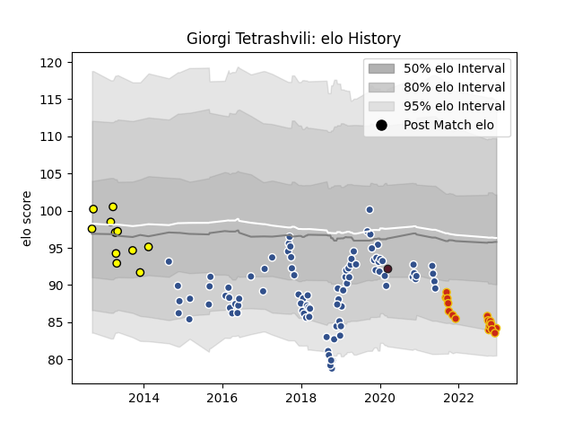

---  
layout: page  
title: Giorgi Tetrashvili  
date: 2022-12-09 13:24:46.552083  
categories: player  
---
# Giorgi Tetrashvili

## Positions: P

## Country: Georgia

## Current elo: 84.0

## Current Percentile: 9.0

# Elo History

# Match History

| Team      |   Appearances |   Win Rate |
|:----------|--------------:|-----------:|
| Agen      |            90 |   0.255556 |
| Perpignan |            15 |   0.333333 |
| Albi      |            11 |   0.363636 |
| Georgia   |             1 |   1        |

| Opponent             |   Matches |   Win Rate |
|:---------------------|----------:|-----------:|
| Stade Toulousain     |         9 |   0        |
| Pau                  |         9 |   0        |
| La Rochelle          |         7 |   0.428571 |
| Lyon                 |         7 |   0.142857 |
| Bordeaux Begles      |         7 |   0.142857 |
| Racing 92            |         7 |   0.285714 |
| Toulon               |         7 |   0.428571 |
| Stade Francais Paris |         6 |   0.333333 |
| Brive                |         6 |   0.166667 |
| Castres Olympique    |         6 |   0.333333 |
| Clermont Auvergne    |         5 |   0        |
| Montpellier Herault  |         4 |   0.25     |
| Bayonne              |         3 |   0.333333 |
| Dax                  |         3 |   0.333333 |
| Grenoble             |         3 |   0.666667 |
| Tarbes               |         2 |   0        |
| Oyonnax              |         2 |   0.5      |
| Mont-de-Marsan       |         2 |   1        |
| Albi                 |         2 |   0.5      |
| Benetton Treviso     |         2 |   0.5      |
| Biarritz Olympique   |         2 |   0.5      |
| London Irish         |         1 |   0        |
| Auch                 |         1 |   0.5      |
| Wasps                |         1 |   0        |
| Beziers              |         1 |   0        |
| Bourgoin-Jallieu     |         1 |   1        |
| Soyaux-Angouleme     |         1 |   1        |
| Carcassonne          |         1 |   1        |
| Provence Rugby       |         1 |   0        |
| Portugal             |         1 |   1        |
| Perpignan            |         1 |   1        |
| Colomiers            |         1 |   0.5      |
| Edinburgh            |         1 |   0        |
| Gloucester Rugby     |         1 |   0        |
| Harlequins           |         1 |   0        |
| Massy                |         1 |   1        |
| Zebre                |         1 |   0        |