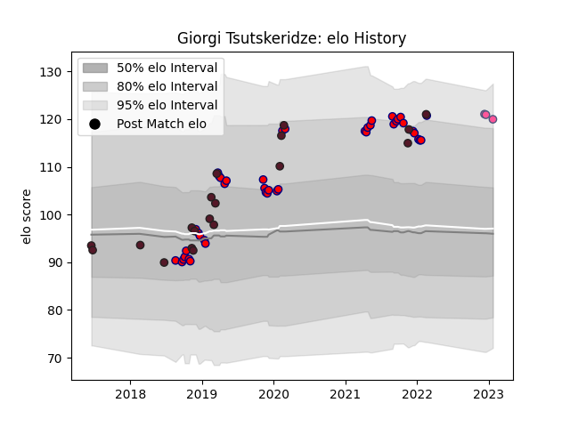

---  
layout: page  
title: Giorgi Tsutskeridze  
date: 2022-12-14 11:22:14.589610  
categories: player  
---
# Giorgi Tsutskeridze

## Positions: FL

## Country: Georgia

## Current elo: 111.0

## Current Percentile: 88.0

# Elo History

# Match History

| Team                 |   Appearances |   Win Rate |
|:---------------------|--------------:|-----------:|
| Aurillac             |            32 |   0.34375  |
| Georgia              |            18 |   0.694444 |
| Stade Francais Paris |             1 |   1        |

| Opponent                 |   Matches |   Win Rate |
|:-------------------------|----------:|-----------:|
| Beziers                  |         4 |       0.25 |
| Bayonne                  |         3 |       0    |
| Biarritz Olympique       |         3 |       0    |
| Nevers                   |         2 |       0    |
| Montauban                |         2 |       0.5  |
| Belgium                  |         2 |       1    |
| US Bressane              |         2 |       0.5  |
| Brive                    |         2 |       0.5  |
| Carcassonne              |         2 |       0    |
| Colomiers                |         2 |       0.5  |
| Provence Rugby           |         2 |       0.5  |
| Spain                    |         2 |       1    |
| Romania                  |         2 |       1    |
| Grenoble                 |         2 |       0.5  |
| Italy                    |         2 |       0    |
| Narbonne                 |         2 |       1    |
| Agen                     |         1 |       0    |
| Russia                   |         1 |       1    |
| Samoa                    |         1 |       1    |
| Soyaux-Angouleme         |         1 |       1    |
| Tonga                    |         1 |       1    |
| Japan                    |         1 |       0    |
| Oyonnax                  |         1 |       1    |
| Netherlands              |         1 |       1    |
| Mont-de-Marsan           |         1 |       0    |
| Argentina                |         1 |       0    |
| Germany                  |         1 |       1    |
| France                   |         1 |       0    |
| Fiji                     |         1 |       0.5  |
| Benetton Treviso         |         1 |       1    |
| United States of America |         1 |       1    |