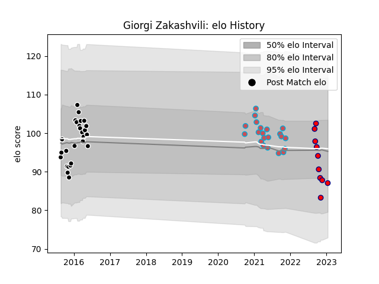

---  
layout: page  
title: Giorgi Zakashvili  
date: 2022-11-22 11:39:45.389548  
categories: player  
---
# Giorgi Zakashvili

## Positions: P

## Current elo: 97.0

## Current Percentile: 56.0

# Elo History

# Match History

| Team                       |   Appearances |   Win Rate |
|:---------------------------|--------------:|-----------:|
| Provence Rugby             |            15 |   0.466667 |
| Bourgoin-Jallieu           |            13 |   0.230769 |
| Cognac Saint Jean d'Angély |             9 |   0        |

| Opponent                   |   Matches |   Win Rate |
|:---------------------------|----------:|-----------:|
| Dax                        |         6 |   0        |
| Chambery                   |         3 |   0.333333 |
| US Bressane                |         2 |   0        |
| Tarbes                     |         2 |   0        |
| Nice                       |         2 |   0        |
| Narbonne                   |         2 |   0.5      |
| Mont-de-Marsan             |         2 |   0        |
| Dijon                      |         2 |   0.5      |
| Aubenas                    |         2 |   0        |
| Albi                       |         2 |   1        |
| Aurillac                   |         2 |   0.5      |
| Carqueiranne-Hyères        |         1 |   0        |
| Carcassonne                |         1 |   1        |
| Bourgoin-Jallieu           |         1 |   1        |
| Montauban                  |         1 |   1        |
| Blagnac                    |         1 |   0        |
| Biarritz Olympique         |         1 |   0        |
| Perpignan                  |         1 |   1        |
| Suresnes                   |         1 |   0        |
| Bayonne                    |         1 |   0        |
| Valence Romans Drome Rugby |         1 |   0        |