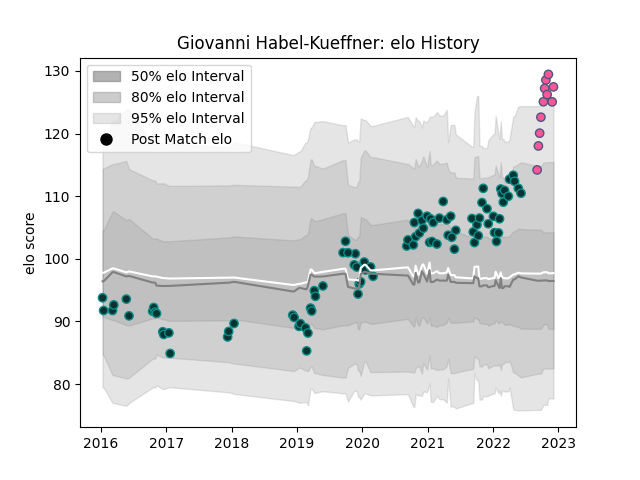

---  
layout: page  
title: Giovanni Habel-Kueffner  
date: 2022-12-31 16:25:59.863213  
categories: player  
---
# Giovanni Habel-Kueffner

## Positions: FL, N8

## Current elo: 139.0

## Current Percentile: 99.0

# Elo History

# Match History

| Team                 |   Appearances |   Win Rate |
|:---------------------|--------------:|-----------:|
| Pau                  |            92 |   0.369565 |
| Stade Francais Paris |            14 |   0.678571 |

| Opponent             |   Matches |   Win Rate |
|:---------------------|----------:|-----------:|
| Stade Francais Paris |         8 |  0.375     |
| La Rochelle          |         7 |  0.142857  |
| Castres Olympique    |         7 |  0         |
| Toulon               |         7 |  0.0714286 |
| Lyon                 |         7 |  0.357143  |
| Clermont Auvergne    |         7 |  0.428571  |
| Stade Toulousain     |         6 |  0.25      |
| Racing 92            |         6 |  0.166667  |
| Montpellier Herault  |         6 |  0.5       |
| Agen                 |         6 |  1         |
| Brive                |         6 |  0.333333  |
| Cardiff Blues        |         4 |  0.25      |
| Bordeaux Begles      |         4 |  0.5       |
| Bayonne              |         3 |  1         |
| Perpignan            |         3 |  1         |
| Calvisano            |         2 |  1         |
| Worcester Warriors   |         2 |  0.5       |
| Biarritz Olympique   |         2 |  1         |
| Pau                  |         2 |  1         |
| Bristol Rugby        |         2 |  0         |
| Leicester Tigers     |         2 |  0.5       |
| Bath Rugby           |         2 |  0         |
| Ospreys              |         1 |  1         |
| Sale Sharks          |         1 |  0         |
| Benetton Treviso     |         1 |  1         |
| Edinburgh            |         1 |  0         |
| Zebre                |         1 |  1         |