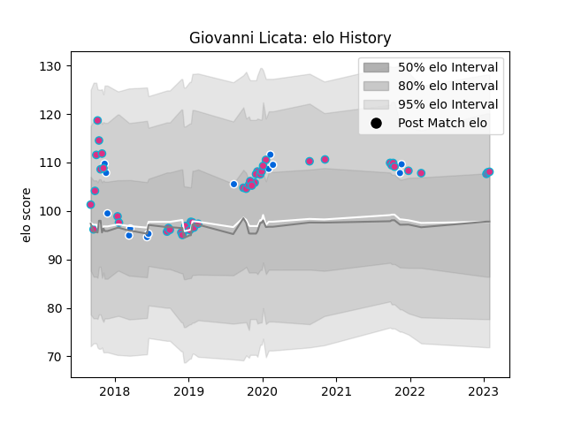

---  
layout: page  
title: Giovanni Licata  
date: 2023-01-15 11:53:33.941363  
categories: player  
---
# Giovanni Licata

## Positions: N8, FL

## Country: Italy

## Current elo: 108.0

## Current Percentile: 75.0

# Elo History

# Match History

| Team   |   Appearances |   Win Rate |
|:-------|--------------:|-----------:|
| Zebre  |            44 |   0.261364 |
| Italy  |            13 |   0.230769 |

| Opponent             |   Matches |   Win Rate |
|:---------------------|----------:|-----------:|
| Cheetahs             |         5 |   0.2      |
| Benetton Treviso     |         4 |   0.25     |
| Ospreys              |         4 |   0.25     |
| Ulster               |         3 |   0.333333 |
| Leinster             |         3 |   0        |
| Agen                 |         2 |   0.5      |
| Glasgow Warriors     |         2 |   0        |
| Scotland             |         2 |   0        |
| RC Enisei            |         2 |   1        |
| Pau                  |         2 |   0        |
| Argentina            |         2 |   0        |
| Japan                |         2 |   0.5      |
| La Rochelle          |         2 |   0        |
| Wales                |         2 |   0        |
| Edinburgh            |         2 |   0        |
| Bristol Rugby        |         2 |   0.25     |
| Dragons              |         2 |   0.5      |
| Cardiff Blues        |         2 |   0.5      |
| Brive                |         1 |   1        |
| Uruguay              |         1 |   1        |
| Stade Francais Paris |         1 |   0        |
| Southern Kings       |         1 |   1        |
| South Africa         |         1 |   0        |
| Ireland              |         1 |   0        |
| Scarlets             |         1 |   0        |
| France               |         1 |   0        |
| Munster              |         1 |   0        |
| Lions                |         1 |   0        |
| Fiji                 |         1 |   1        |
| Bulls                |         1 |   0        |