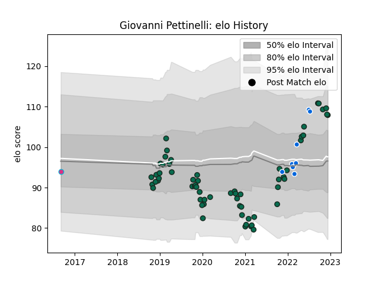

---  
layout: page  
title: Giovanni Pettinelli  
date: 2022-12-09 13:17:58.351974  
categories: player  
---
# Giovanni Pettinelli

## Positions: FL

## Country: Italy

## Current elo: 108.0

## Current Percentile: 86.0

# Elo History

# Match History

| Team             |   Appearances |   Win Rate |
|:-----------------|--------------:|-----------:|
| Benetton Treviso |            62 |   0.354839 |
| Italy            |             8 |   0.25     |
| Zebre            |             1 |   0        |

| Opponent           |   Matches |   Win Rate |
|:-------------------|----------:|-----------:|
| Zebre              |         8 |  0.75      |
| Leinster           |         6 |  0.0833333 |
| Scarlets           |         5 |  0.2       |
| Connacht           |         5 |  0         |
| Glasgow Warriors   |         5 |  0.6       |
| Edinburgh          |         5 |  0.8       |
| Ospreys            |         4 |  0         |
| Ulster             |         4 |  0.125     |
| Munster            |         3 |  0         |
| Dragons            |         3 |  0.666667  |
| Cardiff Blues      |         3 |  0.333333  |
| Northampton Saints |         2 |  0         |
| Southern Kings     |         2 |  1         |
| Harlequins         |         2 |  0.5       |
| Lyon               |         2 |  0.5       |
| Portugal           |         1 |  1         |
| Wales              |         1 |  1         |
| Scotland           |         1 |  0         |
| Agen               |         1 |  0         |
| Lions              |         1 |  0         |
| Argentina          |         1 |  0         |
| Georgia            |         1 |  0         |
| France             |         1 |  0         |
| England            |         1 |  0         |
| Cheetahs           |         1 |  0         |
| Bulls              |         1 |  0         |
| Ireland            |         1 |  0         |