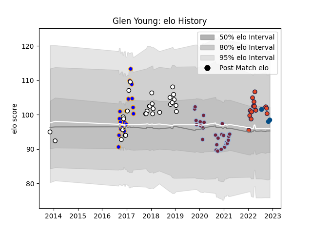

---  
layout: page  
title: Glen Young  
date: 2023-01-30 11:47:07.773492  
categories: player  
---
# Glen Young

## Positions: L, FL

## Country: Scotland

## Current elo: 107.0

## Current Percentile: 76.0

# Elo History

# Match History

| Team              |   Appearances |   Win Rate |
|:------------------|--------------:|-----------:|
| Harlequins        |            29 |   0.465517 |
| Newcastle Falcons |            29 |   0.482759 |
| Doncaster         |            18 |   0.611111 |
| Edinburgh         |            18 |   0.444444 |
| Scotland          |             4 |   0.5      |

| Opponent            |   Matches |   Win Rate |
|:--------------------|----------:|-----------:|
| Bath Rugby          |         7 |   0.571429 |
| Exeter Chiefs       |         6 |   0.166667 |
| London Irish        |         5 |   0.3      |
| Bristol Rugby       |         4 |   0.25     |
| Wasps               |         4 |   0.5      |
| Gloucester Rugby    |         4 |   1        |
| Dragons             |         3 |   1        |
| Northampton Saints  |         3 |   0.666667 |
| Ospreys             |         2 |   0        |
| Montpellier Herault |         2 |   0.5      |
| Lyon                |         2 |   0.5      |
| RC Enisei           |         2 |   1        |
| Lions               |         2 |   0        |
| Richmond            |         2 |   1        |
| Leicester Tigers    |         2 |   1        |
| Jersey              |         2 |   0.5      |
| Rotherham Titans    |         2 |   1        |
| Argentina           |         2 |   0.5      |
| Edinburgh           |         2 |   0        |
| Glasgow Warriors    |         2 |   0        |
| Saracens            |         2 |   0        |
| Cornish Pirates     |         2 |   0        |
| Sharks              |         2 |   0.5      |
| Clermont Auvergne   |         2 |   0        |
| Toulon              |         2 |   0.5      |
| Worcester Warriors  |         2 |   0        |
| Bordeaux Begles     |         2 |   1        |
| Bedford             |         2 |   1        |
| Nottingham          |         2 |   1        |
| Sale Sharks         |         1 |   1        |
| Stormers            |         1 |   0        |
| Pau                 |         1 |   1        |
| Yorkshire Carnegie  |         1 |   1        |
| Leinster            |         1 |   0        |
| Newcastle Falcons   |         1 |   0        |
| Munster             |         1 |   0        |
| London Welsh        |         1 |   0        |
| London Scottish     |         1 |   1        |
| Australia           |         1 |   0        |
| Harlequins          |         1 |   0        |
| Grenoble            |         1 |   0        |
| Ealing Trailfinders |         1 |   0        |
| Connacht            |         1 |   1        |
| Chile               |         1 |   1        |
| Castres Olympique   |         1 |   1        |
| Cardiff Blues       |         1 |   1        |
| Brive               |         1 |   1        |
| Benetton Treviso    |         1 |   0        |
| Zebre               |         1 |   1        |