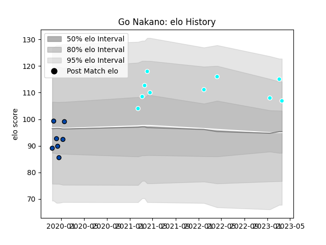

---  
layout: page  
title: Go Nakano  
date: 2023-01-17 11:36:34.999537  
categories: player  
---
# Go Nakano

## Positions: W

## Current elo: 107.0

## Current Percentile: 84.0

# Elo History

# Match History

| Team                             |   Appearances |   Win Rate |
|:---------------------------------|--------------:|-----------:|
| Mazda Blue Zoomers               |             7 |   0.285714 |
| Toyota Industries Shuttles Aichi |             6 |   0.833333 |

| Opponent                         |   Matches |   Win Rate |
|:---------------------------------|----------:|-----------:|
| Shimizu Blue Sharks              |         3 |        1   |
| Coca-Cola Red Sparks             |         2 |        0.5 |
| Kyuden Voltex                    |         2 |        1   |
| Chugoku Red Regulions            |         1 |        1   |
| Hanazono Kintetsu Liners         |         1 |        0   |
| Kamaishi Seawaves                |         1 |        0   |
| Kurita Water Gush                |         1 |        0   |
| Toyota Industries Shuttles Aichi |         1 |        0   |
| Urayasu D-Rocks                  |         1 |        0   |