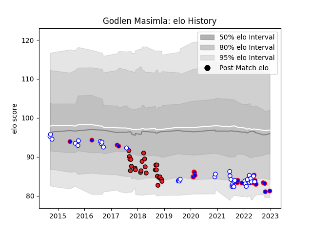

---  
layout: page  
title: Godlen Masimla  
date: 2023-01-06 00:09:52.690039  
categories: player  
---
# Godlen Masimla

## Positions: SH

## Current elo: 91.0

## Current Percentile: 8.0

# Elo History

# Match History

| Team             |   Appearances |   Win Rate |
|:-----------------|--------------:|-----------:|
| Western Province |            36 |   0.375    |
| Southern Kings   |            25 |   0.08     |
| Stormers         |            22 |   0.681818 |

| Opponent               |   Matches |   Win Rate |
|:-----------------------|----------:|-----------:|
| Golden Lions           |         8 |   0.25     |
| Free State Cheetahs    |         7 |   0.142857 |
| Pumas                  |         6 |   0.75     |
| Blue Bulls             |         6 |   0.333333 |
| Scarlets               |         5 |   0.2      |
| Benetton Treviso       |         4 |   0        |
| Natal Sharks           |         4 |   0.25     |
| Lions                  |         4 |   0.5      |
| Ulster                 |         3 |   0.333333 |
| Leinster               |         3 |   0.333333 |
| Griquas                |         3 |   0.333333 |
| Edinburgh              |         3 |   0.5      |
| Dragons                |         3 |   0.333333 |
| Connacht               |         3 |   0.333333 |
| Bulls                  |         3 |   1        |
| Eastern Province Kings |         2 |   1        |
| Munster                |         2 |   0        |
| Ospreys                |         2 |   0.25     |
| Cardiff Blues          |         2 |   0        |
| Sunwolves              |         2 |   1        |
| Zebre                  |         2 |   0        |
| Glasgow Warriors       |         1 |   1        |
| Hurricanes             |         1 |   1        |
| Jaguares               |         1 |   1        |
| Cheetahs               |         1 |   0        |
| Sharks                 |         1 |   0        |
| Blues                  |         1 |   0        |