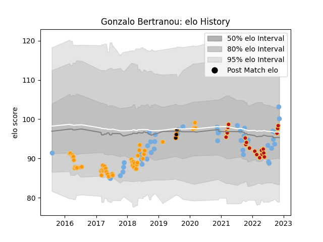

---  
layout: page  
title: Gonzalo Bertranou  
date: 2022-11-16 11:30:14.010945  
categories: player  
---
# Gonzalo Bertranou

## Positions: SH

## Country: Argentina

## Current elo: 100.0

## Current Percentile: 74.0

# Elo History

# Match History

| Team        |   Appearances |   Win Rate |
|:------------|--------------:|-----------:|
| Jaguares    |            48 |   0.416667 |
| Argentina   |            47 |   0.297872 |
| Dragons     |            20 |   0.375    |
| Jaguares XV |             3 |   1        |

| Opponent                 |   Matches |   Win Rate |
|:-------------------------|----------:|-----------:|
| Australia                |        10 |   0.35     |
| Lions                    |         9 |   0.333333 |
| South Africa             |         8 |   0.125    |
| Sharks                   |         7 |   0.142857 |
| New Zealand              |         7 |   0.285714 |
| Bulls                    |         6 |   0.5      |
| Stormers                 |         6 |   0.166667 |
| Scotland                 |         5 |   0.4      |
| Wales                    |         4 |   0.125    |
| England                  |         4 |   0.25     |
| Cardiff Blues            |         3 |   0        |
| Southern Kings           |         3 |   0.666667 |
| Ospreys                  |         3 |   0.666667 |
| Hurricanes               |         3 |   0        |
| Ulster                   |         2 |   0        |
| New South Wales Waratahs |         2 |   1        |
| Scarlets                 |         2 |   0.5      |
| Queensland Reds          |         2 |   0.5      |
| Blues                    |         2 |   0.5      |
| Melbourne Rebels         |         2 |   1        |
| Crusaders                |         2 |   0        |
| France                   |         2 |   0        |
| Brumbies                 |         2 |   0.5      |
| Cheetahs                 |         2 |   1        |
| Edinburgh                |         2 |   0.5      |
| Zebre                    |         2 |   0.5      |
| Ireland                  |         2 |   0        |
| Italy                    |         2 |   1        |
| SWD Eagles               |         1 |   1        |
| Georgia                  |         1 |   1        |
| Glasgow Warriors         |         1 |   1        |
| Eastern Province Kings   |         1 |   1        |
| Border Bulldogs          |         1 |   1        |
| Connacht                 |         1 |   1        |
| Chiefs                   |         1 |   1        |
| Sunwolves                |         1 |   0        |
| United States of America |         1 |   1        |
| Uruguay                  |         1 |   0        |
| Western Force            |         1 |   0        |
| Benetton Treviso         |         1 |   0.5      |