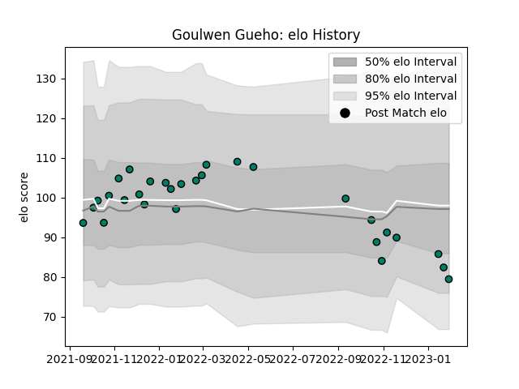

---  
layout: page  
title: Goulwen Gueho  
date: 2023-01-15 12:03:44.760008  
categories: player  
---
# Goulwen Gueho

## Positions: FH, FB

## Current elo: 86.0

## Current Percentile: 28.0

# Elo History

# Match History

| Team     |   Appearances |   Win Rate |
|:---------|--------------:|-----------:|
| Suresnes |            27 |   0.407407 |

| Opponent                   |   Matches |   Win Rate |
|:---------------------------|----------:|-----------:|
| Albi                       |         3 |   0.333333 |
| Valence Romans Drome Rugby |         3 |   0        |
| Aubenas                    |         2 |   0.5      |
| Blagnac                    |         2 |   0.5      |
| Carqueiranne-Hyères        |         2 |   0.5      |
| Chambery                   |         2 |   0        |
| Dax                        |         2 |   0        |
| Dijon                      |         2 |   1        |
| Nice                       |         2 |   0.5      |
| Tarbes                     |         2 |   1        |
| Bourgoin-Jallieu           |         1 |   1        |
| Cognac Saint Jean d'Angély |         1 |   1        |
| Massy                      |         1 |   0        |
| Soyaux-Angouleme           |         1 |   0        |
| US Bressane                |         1 |   0        |