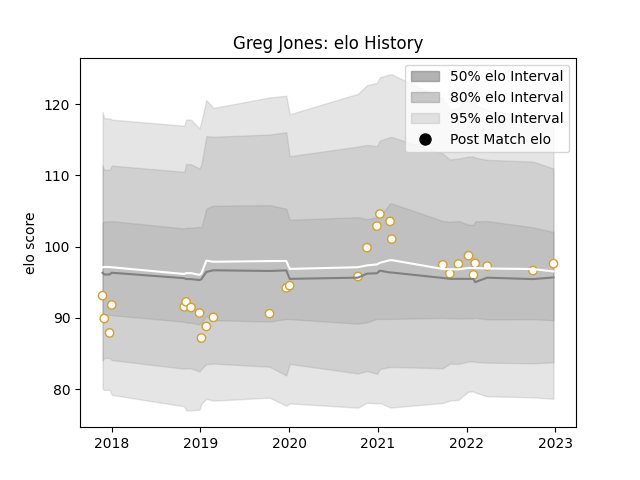

---  
layout: page  
title: Greg Jones  
date: 2022-12-31 16:27:43.662372  
categories: player  
---
# Greg Jones

## Positions: FL, N8

## Current elo: 97.0

## Current Percentile: 54.0

# Elo History

# Match History

| Team   |   Appearances |   Win Rate |
|:-------|--------------:|-----------:|
| Ulster |            29 |    0.62069 |

| Opponent         |   Matches |   Win Rate |
|:-----------------|----------:|-----------:|
| Connacht         |         6 |   0.5      |
| Leinster         |         5 |   0.2      |
| Benetton Treviso |         3 |   0.833333 |
| Munster          |         3 |   0.666667 |
| Dragons          |         2 |   0.75     |
| Glasgow Warriors |         2 |   1        |
| Ospreys          |         2 |   1        |
| Scarlets         |         2 |   0.5      |
| Zebre            |         2 |   1        |
| Southern Kings   |         1 |   1        |
| Stormers         |         1 |   0        |