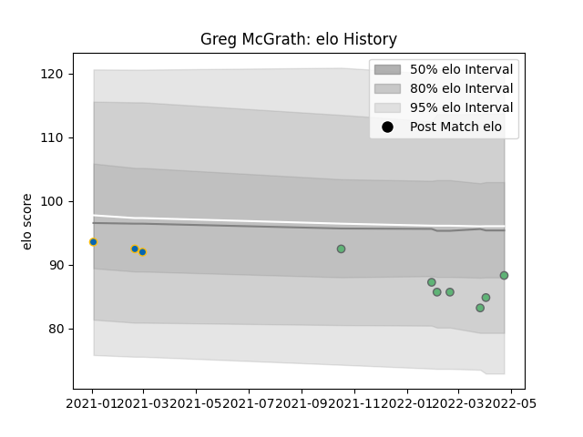

---  
layout: page  
title: Greg McGrath  
date: 2022-12-14 11:12:57.202484  
categories: player  
---
# Greg McGrath

## Positions: P

## Current elo: 91.0

## Current Percentile: 25.0

# Elo History

# Match History

| Team     |   Appearances |   Win Rate |
|:---------|--------------:|-----------:|
| Connacht |             7 |   0.428571 |
| Leinster |             3 |   0.666667 |

| Opponent         |   Matches |   Win Rate |
|:-----------------|----------:|-----------:|
| Glasgow Warriors |         2 |        0.5 |
| Benetton Treviso |         1 |        1   |
| Connacht         |         1 |        0   |
| Dragons          |         1 |        1   |
| Leinster         |         1 |        0   |
| Lions            |         1 |        1   |
| Munster          |         1 |        0   |
| Scarlets         |         1 |        1   |
| Ulster           |         1 |        0   |