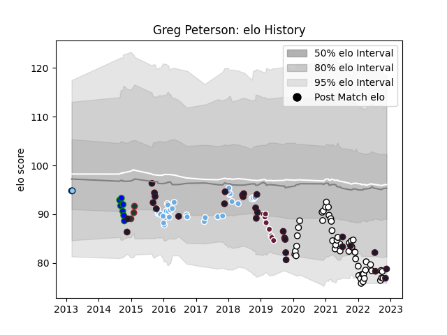

---  
layout: page  
title: Greg Peterson  
date: 2022-12-18 16:24:19.312530  
categories: player  
---
# Greg Peterson

## Positions: L

## Country: United States of America

## Current elo: 76.0

## Current Percentile: 6.0

# Elo History

# Match History

| Team                     |   Appearances |   Win Rate |
|:-------------------------|--------------:|-----------:|
| Newcastle Falcons        |            51 |   0.421569 |
| Glasgow Warriors         |            33 |   0.575758 |
| United States of America |            30 |   0.383333 |
| Bordeaux Begles          |             8 |   0.375    |
| North Harbour Rays       |             8 |   0.375    |
| Leicester Tigers         |             3 |   1        |
| New South Wales Waratahs |             2 |   0.5      |

| Opponent            |   Matches |   Win Rate |
|:--------------------|----------:|-----------:|
| Zebre               |         5 |   1        |
| Bristol Rugby       |         5 |   0.4      |
| Exeter Chiefs       |         5 |   0.6      |
| Harlequins          |         5 |   0.2      |
| Gloucester Rugby    |         4 |   0.25     |
| Cardiff Blues       |         4 |   0.75     |
| Saracens            |         4 |   0        |
| London Irish        |         4 |   0.25     |
| Bath Rugby          |         4 |   0.5      |
| Worcester Warriors  |         4 |   0.625    |
| Northampton Saints  |         4 |   0.5      |
| Ulster              |         3 |   0        |
| Leinster            |         3 |   0.333333 |
| Canada              |         3 |   1        |
| Wasps               |         3 |   0.333333 |
| Dragons             |         3 |   0.833333 |
| Edinburgh           |         3 |   0.333333 |
| Sale Sharks         |         3 |   0.666667 |
| Leicester Tigers    |         3 |   0        |
| Samoa               |         2 |   0.5      |
| Ospreys             |         2 |   0.75     |
| Ireland             |         2 |   0        |
| Racing 92           |         2 |   0.5      |
| Scotland            |         2 |   0.5      |
| Munster             |         2 |   0.5      |
| Chile               |         2 |   0.5      |
| Southern Kings      |         2 |   0.5      |
| Connacht            |         2 |   0.5      |
| Tonga               |         2 |   0        |
| England             |         2 |   0        |
| New Zealand Maori   |         1 |   0        |
| Yorkshire Carnegie  |         1 |   1        |
| Uruguay             |         1 |   0        |
| Toulon              |         1 |   0        |
| Nottingham          |         1 |   1        |
| Perth Spirit        |         1 |   1        |
| Perpignan           |         1 |   1        |
| Portugal            |         1 |   0.5      |
| Sydney Stars        |         1 |   0        |
| Queensland Country  |         1 |   1        |
| Romania             |         1 |   1        |
| Russia              |         1 |   1        |
| NSW Country Eagles  |         1 |   0        |
| Agen                |         1 |   1        |
| Montpellier Herault |         1 |   0        |
| Georgia             |         1 |   0        |
| Argentina           |         1 |   0        |
| Australia           |         1 |   0        |
| Bedford             |         1 |   1        |
| Benetton Treviso    |         1 |   1        |
| Brisbane City       |         1 |   0        |
| Brumbies            |         1 |   0        |
| Canberra Vikings    |         1 |   0.5      |
| Clermont Auvergne   |         1 |   0        |
| Cornish Pirates     |         1 |   1        |
| Fiji                |         1 |   0        |
| France              |         1 |   0        |
| Germany             |         1 |   1        |
| Melbourne Rising    |         1 |   0        |
| Greater Sydney Rams |         1 |   0.5      |
| Grenoble            |         1 |   1        |
| Hartpury College    |         1 |   1        |
| Hong Kong           |         1 |   1        |
| Italy               |         1 |   0        |
| Japan               |         1 |   0        |
| Jersey              |         1 |   1        |
| Ampthill            |         1 |   1        |
| La Rochelle         |         1 |   0        |
| Lyon                |         1 |   0        |
| Melbourne Rebels    |         1 |   1        |
| Kenya               |         1 |   1        |