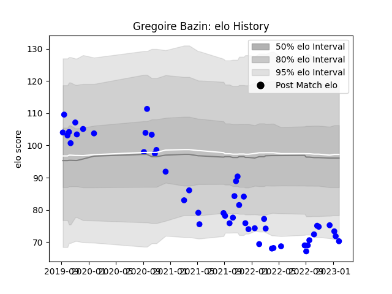

---  
layout: page  
title: Gregoire Bazin  
date: 2022-12-18 16:17:39.961128  
categories: player  
---
# Gregoire Bazin

## Positions: FL

## Current elo: 70.0

## Current Percentile: 1.0

# Elo History

# Match History

| Team   |   Appearances |   Win Rate |
|:-------|--------------:|-----------:|
| Vannes |            35 |   0.528571 |

| Opponent           |   Matches |   Win Rate |
|:-------------------|----------:|-----------:|
| Carcassonne        |         5 |   0.6      |
| Grenoble           |         5 |   0.6      |
| Agen               |         3 |   0.333333 |
| Mont-de-Marsan     |         3 |   1        |
| Oyonnax            |         3 |   0.333333 |
| Provence Rugby     |         3 |   0.333333 |
| Rouen              |         3 |   0        |
| Soyaux-Angouleme   |         2 |   0.5      |
| Aurillac           |         1 |   1        |
| Beziers            |         1 |   1        |
| Biarritz Olympique |         1 |   1        |
| Massy              |         1 |   1        |
| Narbonne           |         1 |   0.5      |
| Nevers             |         1 |   0        |
| Perpignan          |         1 |   0        |
| US Bressane        |         1 |   1        |