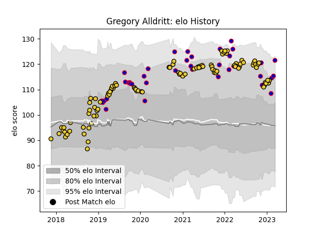

---  
layout: page  
title: Gregory Alldritt  
date: 2022-11-16 11:33:06.963951  
categories: player  
---
# Gregory Alldritt

## Positions: N8, FL

## Country: France

## Current elo: 123.0

## Current Percentile: 94.0

# Elo History

# Match History

| Team        |   Appearances |   Win Rate |
|:------------|--------------:|-----------:|
| La Rochelle |            75 |       0.6  |
| France      |            32 |       0.75 |

| Opponent                 |   Matches |   Win Rate |
|:-------------------------|----------:|-----------:|
| Stade Toulousain         |         9 |   0        |
| Castres Olympique        |         7 |   0.571429 |
| Racing 92                |         7 |   0.714286 |
| Wales                    |         6 |   0.666667 |
| Scotland                 |         6 |   0.5      |
| Toulon                   |         5 |   1        |
| Clermont Auvergne        |         5 |   0.2      |
| Lyon                     |         5 |   0.6      |
| Montpellier Herault      |         4 |   0.25     |
| Pau                      |         4 |   0.75     |
| Bordeaux Begles          |         4 |   0.75     |
| England                  |         4 |   0.5      |
| Ireland                  |         4 |   0.75     |
| Italy                    |         4 |   1        |
| Stade Francais Paris     |         3 |   0.666667 |
| Sale Sharks              |         3 |   0.666667 |
| Agen                     |         3 |   1        |
| Brive                    |         3 |   1        |
| Bristol Rugby            |         3 |   0.666667 |
| Argentina                |         2 |   1        |
| Perpignan                |         2 |   1        |
| RC Enisei                |         2 |   1        |
| Exeter Chiefs            |         2 |   0        |
| Bayonne                  |         2 |   1        |
| New Zealand              |         1 |   1        |
| Glasgow Warriors         |         1 |   1        |
| Georgia                  |         1 |   1        |
| South Africa             |         1 |   1        |
| Tonga                    |         1 |   1        |
| United States of America |         1 |   1        |
| Australia                |         1 |   1        |
| Zebre                    |         1 |   1        |