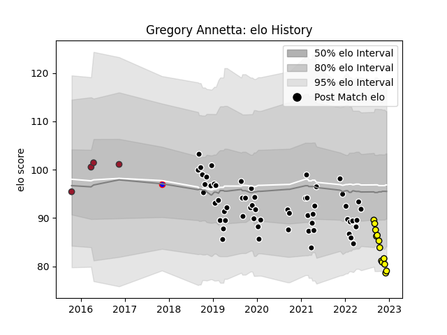

---  
layout: page  
title: Gregory Annetta  
date: 2022-11-22 11:38:27.248997  
categories: player  
---
# Gregory Annetta

## Positions: FL

## Current elo: 83.0

## Current Percentile: 7.0

# Elo History

# Match History

| Team           |   Appearances |   Win Rate |
|:---------------|--------------:|-----------:|
| Provence Rugby |            59 |   0.525424 |
| Carcassonne    |            10 |   0.3      |
| Toulon         |             4 |   0.75     |
| Beziers        |             1 |   0        |

| Opponent             |   Matches |   Win Rate |
|:---------------------|----------:|-----------:|
| Vannes               |         8 |   0.5      |
| Mont-de-Marsan       |         7 |   0.571429 |
| Oyonnax              |         7 |   0.142857 |
| Beziers              |         5 |   0.6      |
| Soyaux-Angouleme     |         5 |   0        |
| Carcassonne          |         5 |   0.4      |
| Grenoble             |         5 |   0.4      |
| Nevers               |         3 |   1        |
| Bayonne              |         3 |   0.666667 |
| Biarritz Olympique   |         3 |   0        |
| Colomiers            |         3 |   0.333333 |
| Rouen                |         3 |   1        |
| Montauban            |         3 |   1        |
| Massy                |         2 |   0.5      |
| Aurillac             |         2 |   0.5      |
| US Bressane          |         2 |   0.5      |
| Stade Francais Paris |         1 |   1        |
| Roval Drome XV       |         1 |   1        |
| Agen                 |         1 |   1        |
| Racing 92            |         1 |   1        |
| Perpignan            |         1 |   1        |
| Pau                  |         1 |   1        |
| Brive                |         1 |   0        |
| Narbonne             |         1 |   0        |