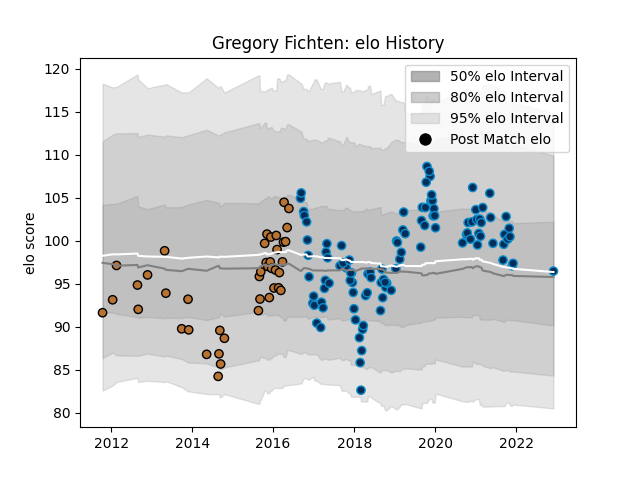

---  
layout: page  
title: Gregory Fichten  
date: 2022-12-09 13:09:20.273692  
categories: player  
---
# Gregory Fichten

## Positions: P

## Current elo: 96.0

## Current Percentile: None

# Elo History

# Match History

| Team                |   Appearances |   Win Rate |
|:--------------------|--------------:|-----------:|
| Montpellier Herault |           105 |   0.519048 |
| Narbonne            |            42 |   0.345238 |

| Opponent             |   Matches |   Win Rate |
|:---------------------|----------:|-----------:|
| Castres Olympique    |        10 |   0.4      |
| Pau                  |         9 |   0.444444 |
| La Rochelle          |         9 |   0.666667 |
| Toulon               |         8 |   0.5      |
| Stade Toulousain     |         8 |   0.375    |
| Lyon                 |         8 |   0.625    |
| Bordeaux Begles      |         8 |   0.625    |
| Racing 92            |         7 |   0.285714 |
| Clermont Auvergne    |         7 |   0.428571 |
| Agen                 |         7 |   0.571429 |
| Stade Francais Paris |         6 |   0.583333 |
| Brive                |         6 |   0.5      |
| Bayonne              |         5 |   0.2      |
| Perpignan            |         4 |   0.5      |
| Carcassonne          |         3 |   0.333333 |
| Mont-de-Marsan       |         3 |   0.333333 |
| Tarbes               |         3 |   0.333333 |
| Colomiers            |         3 |   0        |
| Dax                  |         3 |   0.333333 |
| Aurillac             |         3 |   0.666667 |
| Beziers              |         3 |   0.666667 |
| Provence Rugby       |         2 |   0.5      |
| Newcastle Falcons    |         2 |   0.5      |
| Montauban            |         2 |   0.5      |
| Glasgow Warriors     |         2 |   1        |
| Biarritz Olympique   |         2 |   0        |
| Albi                 |         2 |   0.5      |
| Exeter Chiefs        |         2 |   0        |
| Edinburgh            |         2 |   0.5      |
| Bourgoin-Jallieu     |         2 |   0.5      |
| Grenoble             |         1 |   1        |
| Oyonnax              |         1 |   1        |
| Gloucester Rugby     |         1 |   1        |
| Connacht             |         1 |   0        |
| Auch                 |         1 |   0.5      |
| Massy                |         1 |   0        |