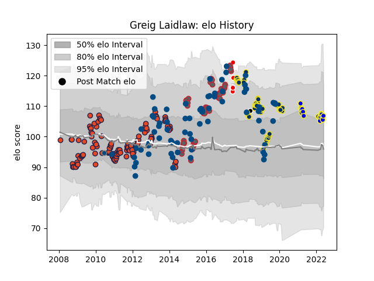

---  
layout: page  
title: Greig Laidlaw  
date: 2023-01-15 11:47:39.621937  
categories: player  
---
# Greig Laidlaw

## Positions: SH, FH

## Country: Scotland

## Current elo: 103.0

## Current Percentile: 64.0

# Elo History

# Match History

| Team                    |   Appearances |   Win Rate |
|:------------------------|--------------:|-----------:|
| Edinburgh               |           126 |   0.43254  |
| Scotland                |            74 |   0.425676 |
| Clermont Auvergne       |            60 |   0.633333 |
| Gloucester Rugby        |            58 |   0.568966 |
| Urayasu D-Rocks         |             9 |   0.222222 |
| British and Irish Lions |             6 |   0.583333 |
| Barbarians              |             1 |   1        |
| Scotland A              |             1 |   0        |

| Opponent                          |   Matches |   Win Rate |
|:----------------------------------|----------:|-----------:|
| Leinster                          |        14 |   0.214286 |
| Munster                           |        13 |   0.230769 |
| Cardiff Blues                     |        13 |   0.461538 |
| Ulster                            |        12 |   0.416667 |
| Connacht                          |        11 |   0.727273 |
| Northampton Saints                |        11 |   0.318182 |
| Glasgow Warriors                  |        10 |   0.25     |
| France                            |        10 |   0.3      |
| Ospreys                           |         9 |   0.666667 |
| La Rochelle                       |         9 |   0.777778 |
| Ireland                           |         9 |   0.222222 |
| Benetton Treviso                  |         9 |   0.666667 |
| Italy                             |         9 |   0.777778 |
| Stade Toulousain                  |         8 |   0.3125   |
| Castres Olympique                 |         8 |   0.625    |
| Bath Rugby                        |         8 |   0.375    |
| Dragons                           |         8 |   0.375    |
| England                           |         8 |   0.3125   |
| Exeter Chiefs                     |         7 |   0.5      |
| Stade Francais Paris              |         7 |   0.571429 |
| Wales                             |         7 |   0        |
| Racing 92                         |         7 |   0.571429 |
| Harlequins                        |         6 |   0.583333 |
| Scarlets                          |         6 |   0.5      |
| South Africa                      |         5 |   0        |
| Bordeaux Begles                   |         5 |   0.4      |
| Wasps                             |         5 |   0.2      |
| Japan                             |         5 |   0.8      |
| London Irish                      |         5 |   1        |
| Sale Sharks                       |         4 |   1        |
| Samoa                             |         4 |   0.75     |
| Leicester Tigers                  |         4 |   0.25     |
| Toulon                            |         4 |   0.5      |
| Aironi                            |         4 |   0.75     |
| Worcester Warriors                |         4 |   0.875    |
| Agen                              |         4 |   0.75     |
| Zebre                             |         4 |   1        |
| Argentina                         |         3 |   1        |
| Australia                         |         3 |   0        |
| Montpellier Herault               |         3 |   0.333333 |
| New Zealand                       |         3 |   0        |
| Saracens                          |         3 |   0        |
| Perpignan                         |         3 |   0.666667 |
| Pau                               |         2 |   1        |
| United States of America          |         2 |   1        |
| Tonga                             |         2 |   0.5      |
| Brive                             |         2 |   1        |
| Georgia                           |         2 |   1        |
| Saitama Wild Knights              |         2 |   0        |
| Fiji                              |         2 |   1        |
| Oyonnax                           |         2 |   1        |
| Lyon                              |         2 |   0.5      |
| Newcastle Falcons                 |         2 |   0.5      |
| Namibia                           |         1 |   0        |
| Yokohama Canon Eagles             |         1 |   0        |
| London Welsh                      |         1 |   1        |
| Black Rams Tokyo                  |         1 |   1        |
| Hurricanes                        |         1 |   0.5      |
| Blues                             |         1 |   0        |
| Toyota Verblitz                   |         1 |   0        |
| Toyota Industries Shuttles Aichi  |         1 |   1        |
| Bristol Rugby                     |         1 |   1        |
| Timisoara Saracens                |         1 |   1        |
| Provincial Union XV               |         1 |   1        |
| New Zealand Maori                 |         1 |   1        |
| Canada                            |         1 |   1        |
| Chiefs                            |         1 |   1        |
| Shizuoka Blue Revs                |         1 |   0        |
| Edinburgh                         |         1 |   1        |
| Kobelco Kobe Steelers             |         1 |   0        |
| Highlanders                       |         1 |   0        |
| Grenoble                          |         1 |   0.5      |
| Gloucester Rugby                  |         1 |   0        |
| Kubota Spears Funabashi Tokyo-Bay |         1 |   0        |