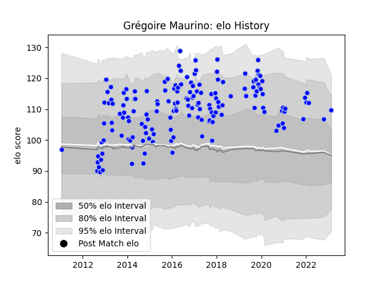

---  
layout: page  
title: Grégoire Maurino  
date: 2023-02-24 02:25:02.455243  
categories: player  
---
# Grégoire Maurino

## Positions: C

## Current elo: 110.0

## Current Percentile: 80.0

# Elo History

# Match History

| Team      |   Appearances |   Win Rate |
|:----------|--------------:|-----------:|
| Colomiers |           157 |   0.563694 |

| Opponent                   |   Matches |   Win Rate |
|:---------------------------|----------:|-----------:|
| Mont-de-Marsan             |        10 |   0.45     |
| Beziers                    |        10 |   0.3      |
| Narbonne                   |        10 |   0.85     |
| Biarritz Olympique         |         9 |   0.666667 |
| Montauban                  |         9 |   0.333333 |
| Albi                       |         8 |   0.3125   |
| Aurillac                   |         8 |   0.75     |
| Carcassonne                |         8 |   0.75     |
| Tarbes                     |         7 |   0.285714 |
| Perpignan                  |         7 |   0.714286 |
| Dax                        |         7 |   0.714286 |
| Massy                      |         6 |   0.833333 |
| Soyaux-Angouleme           |         5 |   0.6      |
| Provence Rugby             |         5 |   0.8      |
| Pau                        |         5 |   0.4      |
| Vannes                     |         5 |   0.6      |
| Bourgoin-Jallieu           |         5 |   0.8      |
| Lyon                       |         4 |   0.25     |
| Nevers                     |         4 |   0.5      |
| Oyonnax                    |         4 |   0.5      |
| Bayonne                    |         4 |   0.25     |
| Auch                       |         3 |   0.833333 |
| Agen                       |         3 |   0.833333 |
| La Rochelle                |         2 |   0        |
| Grenoble                   |         2 |   0.5      |
| Brive                      |         2 |   0        |
| Roval Drome XV             |         2 |   1        |
| Rouen                      |         1 |   1        |
| US Bressane                |         1 |   1        |
| Valence Romans Drome Rugby |         1 |   0        |