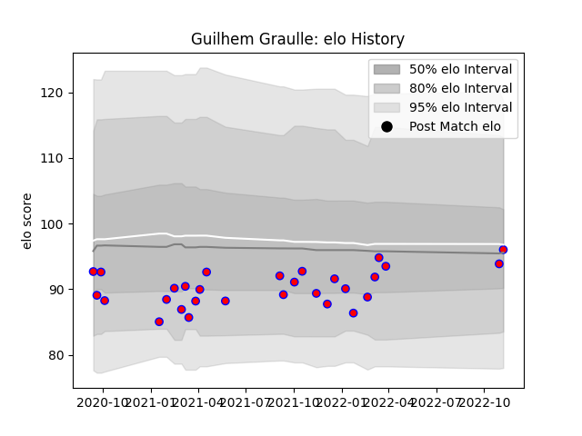

---  
layout: page  
title: Guilhem Graulle  
date: 2022-12-09 13:23:24.550972  
categories: player  
---
# Guilhem Graulle

## Positions: W, C

## Current elo: 95.0

## Current Percentile: 50.0

# Elo History

# Match History

| Team    |   Appearances |   Win Rate |
|:--------|--------------:|-----------:|
| Blagnac |            31 |   0.580645 |

| Opponent                   |   Matches |   Win Rate |
|:---------------------------|----------:|-----------:|
| Albi                       |         3 |   0.333333 |
| Aubenas                    |         3 |   0.666667 |
| Bourgoin-Jallieu           |         3 |   0.666667 |
| Cognac Saint Jean d'Angély |         3 |   0.666667 |
| Suresnes                   |         3 |   0.666667 |
| Chambery                   |         2 |   1        |
| Dax                        |         2 |   0.5      |
| Dijon                      |         2 |   0.5      |
| Massy                      |         2 |   0.5      |
| Nice                       |         2 |   0.5      |
| US Bressane                |         2 |   0        |
| Carqueiranne-Hyères        |         1 |   1        |
| Rennes                     |         1 |   1        |
| Tarbes                     |         1 |   0        |
| Valence Romans Drome Rugby |         1 |   1        |