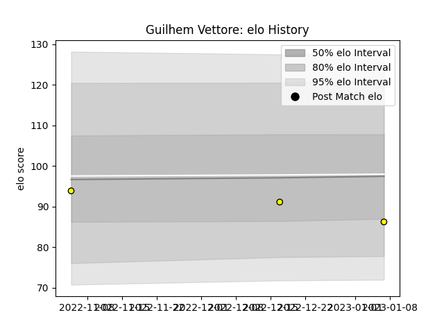

---  
layout: page  
title: Guilhem Vettore  
date: 2023-01-13 11:39:21.106496  
categories: player  
---
# Guilhem Vettore

## Positions: N8

## Current elo: 86.0

## Current Percentile: None

# Elo History

# Match History

| Team        |   Appearances |   Win Rate |
|:------------|--------------:|-----------:|
| Carcassonne |             3 |          0 |

| Opponent       |   Matches |   Win Rate |
|:---------------|----------:|-----------:|
| Colomiers      |         1 |          0 |
| Grenoble       |         1 |          0 |
| Mont-de-Marsan |         1 |          0 |