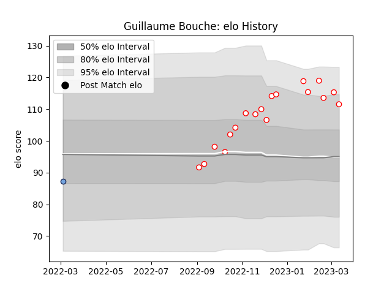

---  
layout: page  
title: Guillaume Bouche  
date: 2023-01-23 15:30:44.842221  
categories: player  
---
# Guillaume Bouche

## Positions: W

## Current elo: 106.0

## Current Percentile: 81.0

# Elo History

# Match History

| Team    |   Appearances |   Win Rate |
|:--------|--------------:|-----------:|
| Dax     |            13 |   0.923077 |
| Bayonne |             1 |   0        |

| Opponent                   |   Matches |   Win Rate |
|:---------------------------|----------:|-----------:|
| US Bressane                |         2 |          1 |
| Blagnac                    |         1 |          1 |
| Bourgoin-Jallieu           |         1 |          0 |
| Carqueiranne-Hyères        |         1 |          1 |
| Chambery                   |         1 |          1 |
| Cognac Saint Jean d'Angély |         1 |          1 |
| Narbonne                   |         1 |          1 |
| Nice                       |         1 |          1 |
| Provence Rugby             |         1 |          0 |
| Rennes                     |         1 |          1 |
| Suresnes                   |         1 |          1 |
| Tarbes                     |         1 |          1 |
| Valence Romans Drome Rugby |         1 |          1 |