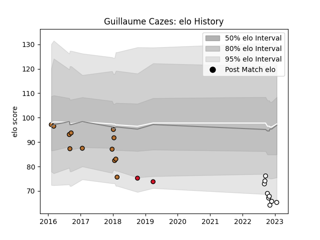

---  
layout: page  
title: Guillaume Cazes  
date: 2023-01-23 15:33:06.451748  
categories: player  
---
# Guillaume Cazes

## Positions: FB

## Current elo: 65.0

## Current Percentile: 3.0

# Elo History

# Match History

| Team                       |   Appearances |   Win Rate |
|:---------------------------|--------------:|-----------:|
| Narbonne                   |            12 |   0.25     |
| Valence Romans Drome Rugby |             9 |   0.833333 |
| Oyonnax                    |             2 |   0        |

| Opponent                   |   Matches |   Win Rate |
|:---------------------------|----------:|-----------:|
| Biarritz Olympique         |         3 |        0   |
| Bourgoin-Jallieu           |         3 |        0.5 |
| Albi                       |         2 |        0.5 |
| Beziers                    |         2 |        0   |
| Colomiers                  |         2 |        0   |
| Rennes                     |         2 |        1   |
| Blagnac                    |         1 |        1   |
| Cognac Saint Jean d'Angély |         1 |        1   |
| Dax                        |         1 |        0   |
| Mont-de-Marsan             |         1 |        1   |
| Narbonne                   |         1 |        1   |
| Perpignan                  |         1 |        0   |
| Soyaux-Angouleme           |         1 |        0   |
| Suresnes                   |         1 |        1   |
| Tarbes                     |         1 |        1   |