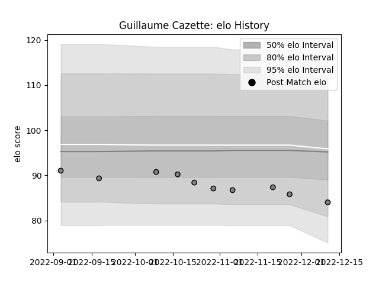

---  
layout: page  
title: Guillaume Cazette  
date: 2022-12-14 11:33:01.352975  
categories: player  
---
# Guillaume Cazette

## Positions: FL, L

## Current elo: 84.0

## Current Percentile: 13.0

# Elo History

# Match History

| Team   |   Appearances |   Win Rate |
|:-------|--------------:|-----------:|
| Rennes |            10 |        0.2 |

| Opponent                   |   Matches |   Win Rate |
|:---------------------------|----------:|-----------:|
| Blagnac                    |         1 |          0 |
| Bourgoin-Jallieu           |         1 |          0 |
| Carqueiranne-Hyères        |         1 |          1 |
| Chambery                   |         1 |          0 |
| Cognac Saint Jean d'Angély |         1 |          1 |
| Dax                        |         1 |          0 |
| Narbonne                   |         1 |          0 |
| Suresnes                   |         1 |          0 |
| US Bressane                |         1 |          0 |
| Valence Romans Drome Rugby |         1 |          0 |