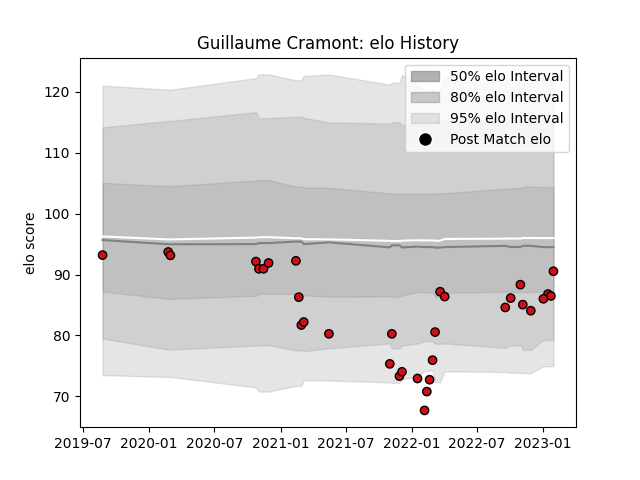

---  
layout: page  
title: Guillaume Cramont  
date: 2023-01-06 00:20:32.238496  
categories: player  
---
# Guillaume Cramont

## Positions: H

## Current elo: 103.0

## Current Percentile: 46.0

# Elo History

# Match History

| Team             |   Appearances |   Win Rate |
|:-----------------|--------------:|-----------:|
| Stade Toulousain |            30 |   0.416667 |

| Opponent             |   Matches |   Win Rate |
|:---------------------|----------:|-----------:|
| Pau                  |         4 |   0.5      |
| Stade Francais Paris |         4 |   0.125    |
| Bayonne              |         3 |   0        |
| Bordeaux Begles      |         3 |   0.333333 |
| Lyon                 |         3 |   0        |
| Montpellier Herault  |         3 |   1        |
| Brive                |         2 |   1        |
| Perpignan            |         2 |   0.5      |
| Agen                 |         1 |   1        |
| Castres Olympique    |         1 |   0        |
| Clermont Auvergne    |         1 |   1        |
| La Rochelle          |         1 |   1        |
| Racing 92            |         1 |   0        |
| Wasps                |         1 |   0        |