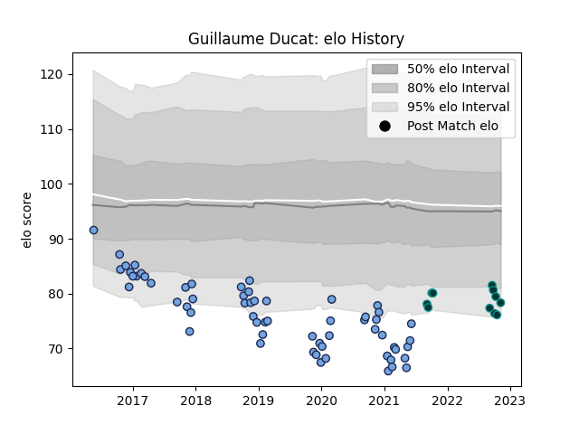

---  
layout: page  
title: Guillaume Ducat  
date: 2022-11-16 11:40:27.768846  
categories: player  
---
# Guillaume Ducat

## Positions: L

## Current elo: 78.0

## Current Percentile: 5.0

# Elo History

# Match History

| Team    |   Appearances |   Win Rate |
|:--------|--------------:|-----------:|
| Bayonne |            61 |   0.385246 |
| Pau     |            11 |   0.454545 |

| Opponent             |   Matches |   Win Rate |
|:---------------------|----------:|-----------:|
| Stade Toulousain     |         6 |   0.666667 |
| Toulon               |         5 |   0.4      |
| Montpellier Herault  |         5 |   0.2      |
| Bordeaux Begles      |         4 |   0.25     |
| Castres Olympique    |         4 |   0        |
| La Rochelle          |         3 |   0        |
| Stade Francais Paris |         3 |   0.333333 |
| Montauban            |         3 |   0.666667 |
| Lyon                 |         3 |   0.333333 |
| Perpignan            |         3 |   0.666667 |
| Brive                |         3 |   0.5      |
| Beziers              |         3 |   0.333333 |
| Gloucester Rugby     |         2 |   0        |
| Provence Rugby       |         2 |   0.5      |
| US Bressane          |         2 |   1        |
| Clermont Auvergne    |         2 |   0.5      |
| Benetton Treviso     |         2 |   0        |
| Carcassonne          |         2 |   0.5      |
| Nevers               |         2 |   1        |
| Racing 92            |         2 |   0        |
| Pau                  |         2 |   0        |
| Vannes               |         2 |   0.5      |
| Agen                 |         1 |   0        |
| Oyonnax              |         1 |   1        |
| Narbonne             |         1 |   1        |
| Massy                |         1 |   1        |
| Leicester Tigers     |         1 |   0        |
| Colomiers            |         1 |   1        |
| Mont-de-Marsan       |         1 |   0        |